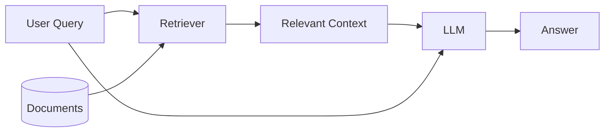
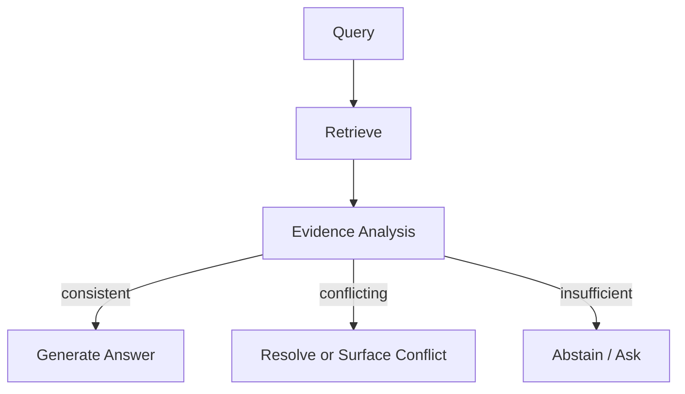

# RAG Works Great—Until Your Documents Disagree

**Retrieving the right documents is only half the problem. The harder question is what the model does when those documents describe different versions of reality.**

I gave a RAG system a question with an almost embarrassingly easy retrieval problem.

The knowledge base contained two documents about the same internal API.

One said:

> Requests are limited to 100 per minute.

The other said:

> Requests are limited to 500 per minute.

Both documents were relevant. Both ranked near the top. Both were retrieved successfully.

The model answered:

> The API supports up to 500 requests per minute.

That answer looked perfectly grounded. It was fluent, specific, and directly supported by one of the retrieved documents.

It was also wrong.

The 500-request limit came from an outdated migration note. The current specification said 100.

Nothing had failed in the conventional RAG pipeline. Embeddings worked. Retrieval worked. The context fit comfortably inside the model's window. The answer even contained information copied from the evidence.

What failed was the assumption that **retrieving relevant evidence means the model is grounded in that evidence**.

It does not.

Once retrieved documents can conflict, become stale, omit important context, or support multiple interpretations, grounding stops being a retrieval problem and starts looking much more like evidence reasoning.

That distinction matters more than it first appears.

---

## The simple RAG mental model is too clean

A simplified RAG system is usually drawn something like this:



The implicit story is straightforward:

1. Find documents related to the question.
2. Give them to the model.
3. Let the model answer using those documents.

This framing makes retrieval quality the obvious bottleneck.

If the answer is bad, perhaps the retriever returned irrelevant chunks. Improve the embeddings. Add reranking. Tune chunk sizes. Retrieve more passages.

Those things matter.

But imagine the retriever becomes perfect.

It returns every document that a human would consider relevant.

The system can still fail.

A more realistic pipeline looks closer to this:

```text
query
  |
  v
retrieve candidate evidence
  |
  +---- current specification
  +---- deprecated documentation
  +---- partial troubleshooting note
  +---- user-written comment
  +---- ambiguous policy page
  |
  v
LLM must decide:
  - which source is authoritative?
  - which one is newer?
  - whether they actually conflict?
  - what information is missing?
  - whether a confident answer is justified?
  |
  v
answer
```

Retrieval determines **what evidence enters the room**.

It does not determine **which evidence wins the argument**.

That second problem is easy to hide because language models are very good at producing a single coherent answer from messy context.

Sometimes too good.

---

## Conflict is not noise

Suppose a company knowledge base contains these passages:

```text
Document A — Employee Handbook 2025
Remote work is permitted up to three days per week.

Document B — HR Policy Update, March 2026
Employees may work remotely up to two days per week.

Document C — Engineering FAQ
Most engineering teams currently work remotely three days per week.
```

The question is:

> How many days per week can employees work remotely?

A vector retriever may correctly return all three.

From a retrieval perspective, this is excellent recall.

From an answering perspective, it is a small reasoning problem.

Document B appears newer than A. But is it globally applicable?

Document C describes actual practice rather than formal policy. Is it an exception, an outdated FAQ, or simply describing what teams currently do despite the official rule?

The correct answer may be:

> The March 2026 HR policy sets the general limit at two days, although the engineering FAQ still describes three-day remote schedules. The FAQ may be outdated or reflect a team-specific exception.

But a normal RAG prompt often encourages something much simpler:

> Answer the user's question based on the provided context.

The model is then asked to compress disagreement into an answer without being given an explicit procedure for resolving disagreement.

It might choose the newest passage.

It might choose the most detailed passage.

It might choose the passage appearing last.

It might implicitly vote across chunks.

It might combine them into something that appears reasonable but is supported by none of them:

> Employees generally work remotely two to three days per week.

That answer is linguistically elegant and epistemically terrible.

No source actually said the policy was "two to three days."

The model did not hallucinate in the classic sense. Every number came from retrieved evidence.

It hallucinated the **relationship between the evidence**.

---

## Relevance and authority are different signals

Embedding search is usually optimized around semantic similarity.

That is useful for answering:

> Which documents talk about this question?

It does not automatically answer:

> Which document should I trust?

Those are different ranking problems.

Imagine retrieving documentation for a software API.

| Source | Relevant? | Current? | Authoritative? |
|---|---:|---:|---:|
| Current API reference | Yes | Yes | High |
| 2024 migration guide | Yes | No | Medium |
| GitHub issue | Yes | Maybe | Low |
| Internal design proposal | Yes | No | Medium |
| User forum answer | Yes | Unknown | Low |

A standard embedding model can easily consider all five highly relevant.

In fact, the obsolete migration guide may rank *higher* than the official reference because its wording resembles the query more closely.

This creates a useful distinction:

```text
retrieval relevance ≠ evidential reliability
```

For production RAG systems, I increasingly think of retrieval as generating **evidence candidates**, not answers.

Those candidates still need interpretation.

That means metadata that initially feels secondary—timestamps, document type, revision number, ownership, status, scope—can become as important as the text itself.

A chunk saying:

```json
{
  "text": "The maximum upload size is 50 MB.",
  "source": "api_reference.md"
}
```

contains less useful information than:

```json
{
  "text": "The maximum upload size is 50 MB.",
  "source": "api_reference.md",
  "version": "v4.2",
  "effective_date": "2026-05-01",
  "status": "current",
  "authority": "official"
}
```

The embedding may barely care about those fields.

The reasoning system probably should.

---

## Stale documents create a particularly nasty failure mode

Outdated information is interesting because it can be both completely relevant and completely wrong.

Consider a support assistant answering:

> Which authentication methods does the service support?

The retriever finds:

```text
2025 documentation:
The service supports password authentication and API keys.
```

and:

```text
2026 security update:
Password authentication has been disabled.
Use OAuth or API keys.
```

A relevance metric may score both documents almost identically.

If evaluation checks only whether the answer mentions one of the supported methods, the system may even receive a good score.

This is one reason RAG benchmarks can look healthier than deployed systems.

Many benchmark questions implicitly assume a static world:

```text
question -> one correct passage -> one correct answer
```

Real knowledge bases are versioned.

Policies change.

APIs are deprecated.

Prices move.

Projects get renamed.

Teams write contradictory documentation.

Humans forget to delete the old page.

The retrieval corpus is therefore not really a database of facts.

It is a database of **claims made at different times by different sources**.

That is a much more complicated object.

---

## More retrieved context can make the answer worse

The natural response to uncertainty is often to retrieve more.

If top-3 retrieval misses something, try top-10.

If top-10 misses something, increase the context window.

This improves recall.

But recall is not monotonically related to answer quality.

Suppose the corpus contains:

```text
2 current documents
4 obsolete documents
3 forum discussions
1 speculative design proposal
```

All ten mention the same feature.

Top-2 retrieval might return the current documents and produce the correct answer.

Top-10 retrieval gives the model the complete history of everyone who has ever been wrong about the feature.

Now the model has more evidence and a harder task.

I like thinking of this as **context dilution**.

The problem is not only that irrelevant information consumes tokens. Relevant-but-incompatible information also consumes reasoning capacity.

A rough conceptual model is:

```text
answer quality
    =
retrieval coverage
    ×
evidence resolution quality
```

Improving retrieval coverage while ignoring evidence resolution eventually stops helping.

In some systems, it actively hurts.

---

## Incomplete evidence is almost the opposite problem

Conflict is obvious when two documents disagree.

Incomplete evidence is harder because nothing visibly contradicts anything.

Suppose a document says:

> Enterprise customers may export audit logs.

The user asks:

> Can I export audit logs?

The retrieved passage is highly relevant.

A model might answer:

> Yes, audit logs can be exported.

But perhaps the user is on the free tier.

The retrieved statement was not false. It was conditional.

The missing evidence was the user's account type.

This shows another gap between retrieval and grounding.

A model can faithfully follow the retrieved sentence while still making an unsupported inference.

The real structure is:

```text
Enterprise(user) -> CanExportLogs(user)
```

but the evidence only establishes the rule.

It does not establish:

```text
Enterprise(current_user)
```

RAG systems frequently collapse these two steps.

This becomes especially dangerous when documents contain requirements, exceptions, permissions, or conditional procedures.

The answer should often be:

> Enterprise customers can export audit logs. I don't have enough information to determine whether your account is eligible.

That response is less satisfying.

It is also much more grounded.

---

## Ambiguity can survive perfect retrieval

There is another class of failures where the documents are accurate and complete, but the question itself maps to multiple interpretations.

Imagine an engineering knowledge base containing:

```text
Memory:
Long-term conversation storage used by the agent.

Memory:
GPU memory consumed during inference.
```

Now ask:

> How much memory does the system use?

The retriever may correctly return documents about both concepts.

This is not a retrieval bug.

The query is underspecified.

A model optimized to always provide an answer may silently pick one interpretation.

A better system needs to recognize when retrieved evidence forms multiple coherent clusters corresponding to different meanings.

That suggests a useful rule:

> Sometimes the best grounded answer is not an answer. It is a clarification question.

RAG systems are often evaluated as if abstention or clarification were failures.

In deployed systems, they can be signs that grounding is actually working.

---

## I would evaluate evidence behavior separately from retrieval

If I were testing a RAG system for production, I would not stop at Recall@K or answer accuracy.

I would deliberately construct cases where retrieval succeeds and reasoning still has opportunities to fail.

For example:

| Test | Documents returned | Desired behavior |
|---|---|---|
| Consistent evidence | Several agreeing sources | Answer confidently |
| Current vs obsolete | Two versions of same policy | Prefer current source |
| Authority conflict | Forum vs official documentation | Prefer authoritative source |
| True ambiguity | Two valid interpretations | Ask for clarification |
| Missing condition | Rule retrieved, user state unknown | State limitation |
| Direct contradiction | Equally authoritative sources disagree | Surface conflict |
| Distracting majority | 1 current + 5 obsolete sources | Do not majority-vote |
| No sufficient evidence | Related documents but no answer | Abstain |

The distinction I care about is:

```text
Did the system retrieve useful information?

versus

Did the system reason correctly about the information it retrieved?
```

Those should be separate measurements.

Otherwise retrieval failures and reasoning failures get mixed into one accuracy number, which makes debugging surprisingly difficult.

---

## What I would change in the architecture

There is no single fix for conflicting evidence, but several interventions are useful.

### 1. Make metadata part of retrieval

Filtering obsolete documents before semantic search can remove entire classes of errors.

For example:

```python
results = vector_store.search(
    query,
    filters={
        "status": "current",
        "product_version": current_version
    }
)
```

This is cheap and deterministic.

The limitation is obvious: metadata needs to be correct.

If document lifecycle management is bad, RAG will faithfully inherit that mess.

### 2. Add reranking based on more than similarity

A second-stage ranker can consider:

- semantic relevance,
- publication time,
- authority,
- document status,
- product version,
- task-specific scope.

Conceptually:

```text
score =
    relevance
  + authority
  + freshness
  + scope_match
```

I would not necessarily reduce this to one literal linear formula, but the mental model is useful.

A source can be relevant while still being a poor piece of evidence.

### 3. Detect contradictions explicitly

For high-value applications, I would consider adding an evidence analysis step before answer generation.



The evidence analysis component can look for:

- conflicting numerical values,
- incompatible policy statements,
- version differences,
- mutually exclusive claims,
- missing preconditions.

This adds latency and cost.

But if the alternative is confidently giving the wrong refund policy or access-control rule, another model call may be cheap.

### 4. Generate claims before generating prose

One architecture I find useful conceptually is:

```text
documents
    ↓
extract supported claims
    ↓
attach provenance
    ↓
resolve claim relationships
    ↓
generate final answer
```

Instead of asking the LLM to simultaneously read, reconcile, infer, and write polished prose, the system separates those operations.

For example:

```json
[
  {
    "claim": "Remote work limit is 3 days/week",
    "source": "handbook_2025",
    "status": "superseded"
  },
  {
    "claim": "Remote work limit is 2 days/week",
    "source": "policy_2026",
    "status": "current"
  }
]
```

Now the final generation step receives a much cleaner reasoning problem.

The cost is more pipeline complexity.

And every additional component creates another component that can fail.

That is the recurring joke of AI engineering.

---

## The model should be allowed to say "the documents disagree"

One surprisingly effective intervention is also one of the least glamorous: change what counts as a successful answer.

If the system is instructed that it must always produce one definitive response, it will often turn uncertainty into confidence.

Instead, I would explicitly allow outputs such as:

> The retrieved sources conflict.

> The latest document says X, while an older document says Y.

> The available evidence does not establish whether this condition applies.

> I found two plausible interpretations of your question.

This changes the objective.

The system is no longer optimizing only for answering.

It is optimizing for **representing the state of the evidence**.

That is a much better definition of grounding.

---

## What I would actually ship

For a small internal RAG application, I would resist building an elaborate multi-stage epistemic reasoning engine on day one.

I would start with boring controls:

1. clean document versioning,
2. useful metadata,
3. metadata filtering,
4. reranking,
5. source citations,
6. explicit permission to abstain,
7. a conflict-heavy evaluation set.

Then I would log retrieved chunks alongside generated answers.

Not just failed queries.

Successful ones too.

I would specifically look for answers where the retriever returned contradictory evidence but the model produced suspiciously smooth prose.

Those are often more informative than obvious failures.

For higher-risk systems—policy assistants, technical support automation, financial workflows, tool-using agents—I would add explicit evidence resolution and provenance tracking.

And I would measure at least three separate things:

```text
retrieval correctness
evidence interpretation correctness
final answer correctness
```

A single end-to-end accuracy metric hides too much.

---

## Grounding is a behavior, not a context window

I used to think about RAG grounding mostly spatially.

The relevant fact needed to be **inside the context window**.

If it was there, the model had access to the truth.

But access is not grounding.

A model is grounded only if its answer reflects the evidence appropriately: following stronger sources over weaker ones, respecting conditions, noticing contradictions, accounting for time, and admitting when the available documents do not justify a single answer.

That makes grounding less like document lookup and more like disciplined evidence handling.

The retriever can do its job perfectly and still hand the model two different versions of reality.

At that point, the interesting question is no longer:

> Did we retrieve the right document?

It is:

> Does the system know what to do when the right documents disagree?

---

## Homepage Excerpt

RAG can retrieve exactly the right documents and still produce the wrong answer. Conflicting versions, stale policies, missing conditions, and ambiguity turn grounding from a retrieval problem into an evidence-reasoning problem.

## Tags

`RAG` · `LLM` · `Retrieval-Augmented Generation` · `LLM Evaluation` · `AI Engineering` · `Grounding` · `Robustness`
