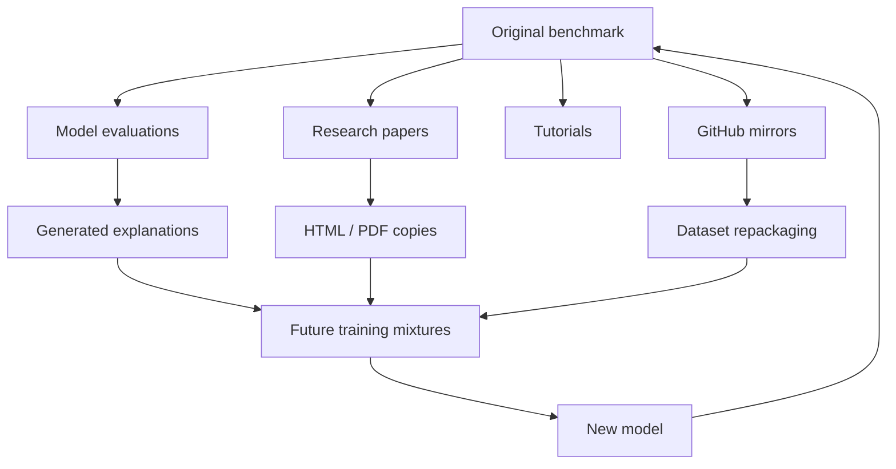

# Did the Model Reason—or Has It Seen the Answer Before?

**A high benchmark score can mean strong reasoning, good pattern recognition, accidental familiarity with the test set—or some uncomfortable combination of all three.**

---

I once looked at a model result that was almost suspiciously good.

The task was not impossible, but it was difficult enough that I expected a visible distribution of failures: a few arithmetic mistakes, some brittle reasoning, maybe confusion around unusual wording. Instead, the model moved through the examples with remarkable confidence.

My first reaction was the pleasant one: perhaps the model was simply better than I expected.

My second reaction was less convenient:

**What if it had already seen these questions?**

That question sounds simple, but it opens a surprisingly difficult evaluation problem.

When a language model gets 92% on a benchmark, we naturally want to interpret that number as evidence of capability. The model understood the task, reasoned through unfamiliar examples, and produced correct answers.

But the benchmark score itself cannot tell us *how* the answer was produced.

A model might genuinely generalize.

It might recognize a highly familiar problem template.

It might remember fragments of an answer from training.

It might have seen the exact benchmark question on GitHub, in a paper appendix, in a benchmark repository, in generated training data, or in somebody else's model outputs.

And because modern training corpora are huge, partially undisclosed, repeatedly filtered, deduplicated, mixed, regenerated, and distilled, distinguishing these cases is much harder than checking whether one CSV file appeared in the pretraining dataset.

The benchmark score went up.

Whether the model became smarter is a different question.

---

## A benchmark quietly assumes the model has never taken the exam

Most benchmarks rely on an implicit experimental setup:

```text
training data
     │
     ▼
┌───────────┐
│   Model   │
└───────────┘
     │
     │ previously unseen task
     ▼
┌───────────┐
│ Benchmark │
└───────────┘
     │
     ▼
  Score
```

The interesting quantity is supposed to be the model's ability to go from its learned knowledge and mechanisms to an answer it has not encountered before.

In machine-learning terminology, we care about **generalization**.

Now consider a slightly different pipeline:

```text
benchmark
   │
   ├────────► webpage
   ├────────► GitHub repository
   ├────────► paper appendix
   ├────────► tutorial
   └────────► synthetic dataset
                    │
                    ▼
               training corpus
                    │
                    ▼
                 model
                    │
                    ▼
               benchmark
```

Nothing about the final evaluation script changes.

We still call:

```python
accuracy = evaluate(model, benchmark)
```

and receive a perfectly respectable floating-point number.

But its interpretation has changed.

The test set is no longer purely testing transfer to unseen examples. Some portion may instead be testing whether information associated with those examples survived training.

That is benchmark contamination in its simplest form.

Unfortunately, the real version is messier.

---

## "Has the model seen this example?" is not a binary question

A useful mental model is to stop treating contamination as a boolean variable.

There are several levels of familiarity.

Imagine evaluating this question:

> A shop reduces a €120 item by 25%. What is the new price?

The model could have encountered:

1. **The exact question and exact answer**
2. The same question with slightly different formatting
3. A paraphrased version using `$120`
4. The same numerical structure with different objects
5. Thousands of examples of `25% discount` calculations
6. The underlying mathematical concept only

Those situations are not equivalent.

The last one is exactly what we want training to accomplish. A model should learn general mathematical patterns from examples.

The first one is much closer to answering from memory.

The interesting cases are everything in between.

This creates a continuum:

```text
Exact memorization
      │
      ▼
Near-duplicate recognition
      │
      ▼
Template familiarity
      │
      ▼
Task familiarity
      │
      ▼
General learned capability
```

The boundary between memorization and generalization is not clean.

That is one reason contamination detection becomes awkward: even if I could perfectly search the training corpus, I would still need to decide what level of similarity invalidates an evaluation.

---

## Exact matching catches the easy contamination

If training data is available, the most obvious test is to search for benchmark examples.

For normalized strings, the first pass can be almost embarrassingly simple:

```python
def normalize(text: str) -> str:
    return " ".join(text.lower().split())

benchmark_question = normalize(question)

if benchmark_question in normalized_training_corpus:
    print("possible contamination")
```

At larger scale, I would obviously avoid scanning a gigantic corpus linearly. Hashes, n-gram indexes, MinHash, locality-sensitive hashing, or a search engine make more sense.

But the underlying idea is straightforward.

Exact overlap is useful evidence.

It is also the easiest version of the problem.

Suppose the benchmark contains:

> Which planet is known as the Red Planet?

and the training data contains:

> **Q:** What planet is commonly called "the Red Planet"?  
> **A:** Mars.

Character-level matching may miss it completely.

Embedding similarity might detect it, but now we have introduced thresholds.

How similar is suspiciously similar?

A similarity score of `0.96` is probably interesting.

What about `0.83`?

And how do we distinguish a contaminated benchmark item from two independently written questions about an extremely common fact?

The better our detector becomes at semantic matching, the more it starts flagging legitimate conceptual similarity.

---

## Public benchmarks have a strange success problem

A benchmark becomes more useful when people use it.

Unfortunately, widespread use also makes it harder to preserve as an unseen test.

A successful benchmark appears in:

- repositories,
- model evaluation harnesses,
- research papers,
- issue discussions,
- tutorials,
- leaderboards,
- Hugging Face datasets,
- blog posts,
- notebooks,
- prompt collections,
- model-generated explanations.

Then those pages become potential training data.

Even if a model developer explicitly removes the original benchmark repository, derived versions may remain.

Someone may have converted the dataset from JSON to Markdown.

Another person may have posted incorrect questions with corrected answers.

A teacher may have turned benchmark problems into exercises.

A model may have generated explanations for every benchmark item, and those explanations may later enter another model's training corpus.

This is where the clean picture of "training set versus test set" starts to collapse.

Data now has ancestry.



By the time the model is evaluated, asking whether it has "seen the benchmark" may require reconstructing a data supply chain that nobody fully recorded.

---

## Memorization does not always look like copying

There is another assumption I do not trust:

> If the model memorized the answer, it should reproduce the original text.

Not necessarily.

Neural networks are not databases with a convenient `SELECT * FROM memories` interface.

A memorized association can affect predictions without producing verbatim reproduction.

Suppose a multiple-choice model sees:

```text
Question X -> option C
```

many times during training.

At evaluation time, the choices are reordered.

If the model memorized the semantic answer, it may still succeed.

If it memorized superficial position patterns, it may fail.

If it partially remembers a familiar explanation, that memory may simply make one answer much more probable.

From the outside, this can look indistinguishable from reasoning.

That means contamination can change not just whether a model knows an answer, but also **how much search it needs to perform internally before reaching it**.

A familiar problem might produce:

- shorter reasoning traces,
- unusually high confidence,
- lower sensitivity to distracting information,
- faster convergence to the answer.

None of these signals proves memorization.

But together they can become useful evidence.

---

## Perturb the question and see what survives

One experiment I like conceptually is simple:

**Do not ask the benchmark question only once. Create nearby versions of it.**

Suppose the original problem is:

> Alice has 12 apples. She gives 5 to Bob. How many remain?

Now generate variants:

### Surface perturbation

> Alice owns twelve apples and gives Bob five. How many does she have left?

The semantics are identical.

### Numerical perturbation

> Alice has 17 apples. She gives 8 to Bob.

Same structure, different answer.

### Entity perturbation

> A warehouse contains 12 packages and ships 5.

Same underlying operation.

### Structural perturbation

> Alice has 12 apples. Bob gives her 5 more.

Now the required operation changes.

A genuinely robust capability should survive many semantics-preserving changes and react correctly when the semantics change.

A memorized association may be much more brittle.

You can think of evaluation less as asking one question and more as measuring a local neighborhood around it:

\[
f(x), f(x + \delta_1), f(x + \delta_2), \dots
\]

where each \(\delta\) changes some controlled property.

The interesting measurement is not only:

```text
Did the model get x right?
```

but:

```text
Does its behavior remain consistent under transformations
that should preserve the answer?

Does it change when transformations should change the answer?
```

This does not solve contamination.

But it gives us much more information than a single accuracy point.

---

## The benchmark may be contaminated even if the exact answers are not

There is a subtler failure mode I find more interesting.

Imagine a benchmark built around a specific reasoning format.

Each example contains an unusual structure:

```text
object → relation → transformation → final category
```

Perhaps the exact benchmark questions never entered training.

But thousands of solutions, generated examples, fine-tuning samples, and benchmark-inspired tasks did.

The model may therefore become extremely optimized for that benchmark's distribution.

Is that contamination?

Strictly speaking, perhaps not.

But it means performance may tell us more about **distribution familiarity** than broad reasoning ability.

This matters because benchmarks often become training targets indirectly.

Once a leaderboard matters, optimization pressure follows.

Researchers inspect errors.

Prompts are tuned.

Training mixtures are adjusted.

Synthetic data is generated for weak categories.

Models are selected based on benchmark performance.

Even without directly training on the test answers, the development process gradually adapts to the evaluation.

Software engineers already know a version of this problem.

If I repeatedly modify an implementation until it passes one fixed test suite, eventually those tests stop being a completely independent measurement of quality.

The code may be improving.

But the test suite is also shaping the code.

Benchmarks behave similarly.

---

## Secret test sets help, but they create another trade-off

The obvious solution is to keep evaluation data private.

This is attractive.

If benchmark questions are generated after model training, or stored in a hidden test set, direct contamination becomes much less likely.

For serious evaluation, I would trust this far more than a decade-old dataset mirrored across the internet.

But private benchmarks introduce costs.

| Approach | Contamination resistance | Reproducibility | Transparency | Maintenance |
|---|---:|---:|---:|---:|
| Fully public static benchmark | Low | Excellent | Excellent | Low |
| Public train, hidden test | Medium–High | Good | Medium | Medium |
| Continuously refreshed private tests | High | Lower | Lower | High |
| Procedurally generated tasks | Potentially high | Good | Medium | High |
| Human-created post-training evaluation | High | Variable | Medium | Very high |

A private benchmark is harder to inspect.

Researchers cannot easily verify whether questions are ambiguous.

Debugging unexpected failures becomes harder.

External reproducibility decreases.

And eventually private questions can leak too.

The solution therefore cannot simply be "make everything secret."

---

## Dynamic evaluation is much harder to memorize

A more promising direction is to evaluate **capabilities that generate many possible test instances** rather than a fixed collection of famous questions.

Instead of storing:

```text
Question 1
Question 2
Question 3
...
Question 5000
```

define a task generator:

```python
def generate_problem(rng):
    entities = sample_entities(rng)
    constraints = sample_constraints(rng)
    target = sample_target(rng)

    return build_problem(
        entities=entities,
        constraints=constraints,
        target=target,
    )
```

Now the model encounters a fresh instance during evaluation.

For example, a planning benchmark could randomly generate:

- available tools,
- dependencies,
- object states,
- constraints,
- distractors,
- success conditions.

This does not make memorization irrelevant. The model can still learn the underlying task family.

But that is exactly what we want to measure.

The evaluation shifts from:

> Do you remember these 500 tasks?

toward:

> Can you solve new tasks sampled from this capability distribution?

There is an engineering catch.

Generating valid tasks is hard.

If the generator accidentally produces impossible or ambiguous cases, we measure generator bugs instead of model capability.

For agent benchmarks, it becomes even harder because the environment itself must remain consistent.

So dynamic evaluation trades contamination risk for infrastructure complexity.

That is usually a trade I am willing to make.

---

## Agents make the problem slightly easier—and much harder

Tool-using agents introduce an interesting twist.

A text benchmark often ends with one answer:

```text
model → "42"
```

An agent produces a trajectory:

```text
observe
  ↓
reason
  ↓
select tool
  ↓
construct arguments
  ↓
observe result
  ↓
update state
  ↓
select next action
```

Even if an agent has seen a similar task before, memorizing the final answer is often insufficient.

It still needs to interact correctly with the current environment.

That gives us additional evaluation signals:

- Was the correct tool selected?
- Were the arguments valid?
- Did the agent inspect necessary state?
- Did it recover after a failed action?
- Did it respect constraints?
- Did it reach success through a sensible trajectory?

But agents create a new form of benchmark overfitting.

A model may learn benchmark-specific tool names and workflow conventions:

```text
search_database()
book_item()
submit_answer()
```

and look excellent inside that environment.

Rename the tools, alter the schema, reorder observations, or introduce one unfamiliar intermediate state, and performance can drop sharply.

So for agents, I would not only vary the task.

I would vary parts of the interface too.

A good agent evaluation should test whether the system learned:

```text
"when I need information, retrieve it"
```

rather than:

```text
"benchmark tasks usually begin with calling tool_3"
```

---

## Can we detect contamination from the model alone?

Sometimes we do not have the training corpus.

That is common with closed models, and even open models may not provide a complete traceable dataset.

Then the question becomes harder:

**Can model behavior reveal whether an example was memorized?**

There are several possible signals.

### Ask for unusual continuations

If a benchmark question exists online with a distinctive explanation, prompt the model with the beginning and see whether it reproduces rare wording.

Strong continuation similarity can be suspicious.

But absence of reproduction proves almost nothing.

### Measure sensitivity to perturbations

Keep the reasoning structure while changing values, names, ordering, or irrelevant details.

A sharp drop may indicate reliance on surface familiarity.

But it could also expose a genuine robustness weakness.

### Compare familiar and newly generated tasks

Create fresh examples testing the same skill.

If performance is:

```text
public benchmark:       94%
fresh matched problems: 67%
```

I would investigate.

The gap is more informative than either number alone.

### Examine confidence

Memorized items might produce unusually confident predictions.

Unfortunately, modern language-model confidence is poorly calibrated enough that I would treat this only as supporting evidence.

None of these methods gives a magical contamination detector.

They give us something more realistic: **a collection of tests that can make the memorization hypothesis more or less plausible.**

---

## I would stop reporting one benchmark number

If I were evaluating an important model, I would not want the main result to look like this:

```text
Benchmark X: 91.7%
```

That number is compact.

It is also carrying far too much responsibility.

I would rather build a small evaluation matrix.

| Evaluation | Question it answers |
|---|---|
| Original public benchmark | Can the model solve the standard test? |
| Paraphrased items | Is performance robust to surface wording? |
| Counterfactual variants | Does the answer track changed facts? |
| Fresh matched examples | Does performance transfer to unseen instances? |
| Harder compositional variants | Does the learned capability scale? |
| Procedurally generated tasks | Can the model generalize within the task family? |
| Out-of-distribution variants | How brittle is the learned strategy? |

The interesting quantity becomes the **shape of performance across conditions**.

Consider two hypothetical models:

```text
                 Public    Paraphrase    Fresh    OOD
Model A            95%         93%        91%     78%
Model B            97%         84%        69%     51%
```

If I only published the first column, Model B would win.

If I wanted a system that had to survive unfamiliar inputs, I would probably choose Model A.

This is exactly why contamination is not merely a dataset hygiene problem.

It is an evaluation-design problem.

---

## What I would actually trust

I do not think the right response is to declare every public benchmark useless.

Stable public benchmarks are still valuable.

They allow comparisons across systems.

They reveal regressions.

They make research reproducible.

They give us shared reference points.

I would simply change how much evidence I require before making a strong capability claim.

For something I genuinely cared about deploying, my evaluation would combine three layers.

First, I would keep the standard benchmark because comparability is useful.

Second, I would create controlled transformations of the benchmark: paraphrases, changed values, reordered options, modified entities, altered tool schemas, or other perturbations appropriate to the task.

Third, I would create fresh evaluation data after the model and prompt configuration were fixed.

That last step matters.

If I generate a hidden test set, evaluate the model, inspect all failures, modify the system, and repeat this process fifty times, my hidden set has quietly become development data.

So I would separate:

```text
development evaluation
        │
        ▼
model / prompt decisions frozen
        │
        ▼
fresh final evaluation
```

It is not glamorous.

It is basically experimental hygiene.

But a surprising amount of model evaluation becomes clearer once you treat benchmarks less like immutable measures of intelligence and more like software tests that can be leaked, overfit, gamed, and accidentally optimized against.

---

## Maybe "reasoning or memorization?" is the wrong question

The more I think about contamination, the less useful the binary question becomes.

Neural models learn from examples.

Of course prior exposure affects future reasoning.

Humans work the same way: solving a familiar type of problem is easier than inventing a strategy from scratch.

The important question is not whether the model has learned from similar examples.

It should.

The question is how far its capability extends beyond them.

If I change the names, does it still work?

If I change the numbers?

If I reverse one relation?

If I replace the tool API?

If I create a new instance tomorrow that could not possibly have existed in the training corpus?

If the answer remains correct across those changes, I become much more comfortable calling the behavior generalization.

A benchmark therefore should not be treated as a final exam with one score.

I prefer to think of it as a probe.

Move the probe around.

Change the surface form.

Change the underlying state.

Generate new instances.

Push slightly outside the familiar distribution.

Then watch where the model's competence survives.

Because the strongest evidence that a model can reason is not that it knows the answer to a question we have been asking models for years.

It is that when we change the question in exactly the ways memorization should not survive, the capability does.

---

## Homepage excerpt

A model gets an extraordinary benchmark score. Great—but did it solve the problems, recognize familiar templates, or remember the test? The interesting part of evaluation starts when one number is no longer enough.

## Tags

`LLM Evaluation` · `Benchmark Contamination` · `Memorization` · `Generalization` · `AI Robustness` · `Language Models` · `Agent Evaluation`
