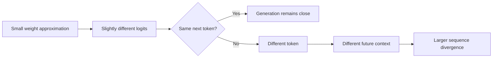

# What Actually Breaks When You Quantize an LLM?

*Quantization can cut model memory dramatically without obviously hurting benchmark accuracy. The interesting question is what changes before the benchmark notices.*

I used to think about quantization mostly as a deployment switch.

Load the model in FP16. Measure memory. Load it again in 8-bit or 4-bit. Measure memory again. Run a benchmark. If the score barely moves, declare victory.

That mental model works surprisingly well right up until it doesn't.

A quantized model can produce almost the same aggregate accuracy as its higher-precision version while becoming noticeably different in the places that matter to an application: instruction following, confidence margins, structured output, rare-token prediction, long generations, or the stability of a tool-calling loop.

The difficult part is that quantization does not usually break a model in a clean, binary way. It perturbs thousands of small numerical decisions, most of which are harmless. Occasionally, one of those perturbations happens near a decision boundary and changes the trajectory of an entire generation.

So the question I find more useful is not:

> Does 4-bit quantization reduce accuracy?

It is:

> **Which behaviors become less stable when we reduce numerical precision, and do those behaviors matter for the system we are actually deploying?**

That turns quantization from a compression question into an evaluation problem.

## The memory win is real

Start with the easy part.

Ignoring some implementation details, storing a model with \(N\) parameters costs roughly:

\[
\text{memory} \approx N \times \text{bits per parameter}
\]

A 7-billion-parameter model stored in FP16 therefore needs roughly:

\[
7 \times 10^9 \times 16 \text{ bits}
\approx 14 \text{ GB}
\]

just for its weights.

At 8 bits, that becomes roughly 7 GB.

At 4 bits, roughly 3.5 GB.

Real systems need additional memory for quantization metadata, buffers, KV cache, runtime state, and sometimes dequantized intermediate values, so these numbers are not the complete GPU memory footprint. But the basic advantage is hard to argue with.

| Weight format | Approx. storage for 7B parameters | Relative weight memory |
|---|---:|---:|
| FP32 | 28 GB | 2× FP16 |
| FP16 / BF16 | 14 GB | 1× |
| INT8 | 7 GB | 0.5× |
| INT4 | 3.5 GB | 0.25× |

That difference can completely change what is deployable.

A model that barely fits on a large GPU might fit comfortably after quantization. A smaller model might move from GPU-only inference to a laptop. A local agent that previously required a remote API might become feasible entirely on-device.

This is why quantization is so attractive: the benefit is immediate, measurable, and operationally important.

Unfortunately, memory is also the easiest metric.

## Quantization is not just "using smaller numbers"

The simplest intuition is that quantization replaces a large set of possible numerical values with a smaller set.

Imagine a few weights:

```text
0.137
0.141
0.148
0.905
-0.332
```

A high-precision representation can preserve these values fairly closely.

A low-bit representation might instead map them to a smaller collection of available levels:

```text
0.14
0.14
0.14
0.91
-0.35
```

Each approximation looks tiny.

Across billions of parameters, however, the model is now slightly different.

A typical quantization scheme can be thought of approximately as:

\[
q = \text{round}\left(\frac{x}{s}\right)
\]

with a corresponding reconstruction:

\[
\hat{x} = s q
\]

where \(s\) is a scale factor and \(q\) is the quantized value.

Real techniques are much more careful than globally rounding every parameter. They may use per-channel or group-wise scales, special handling for outliers, non-uniform representations, calibration data, or mixed precision.

The reason all of that machinery exists is simple: **weights are not equally sensitive to approximation**.

Some can move significantly without changing model behavior.

Others cannot.

And we usually do not know which ones matter by looking at the weight tensor alone.

## The first surprise: lower precision does not automatically mean faster

Suppose I reduce a model from FP16 to INT4.

The model becomes much smaller.

It is tempting to expect inference latency to improve by roughly the same factor.

That rarely happens.

Inference performance depends on more than how many bits are required to store the weights.

A simplified inference path looks something like this:

```text
       Quantized weights
              │
              ▼
      ┌─────────────────┐
      │ Load from memory │
      └────────┬────────┘
               │
               ▼
      ┌─────────────────┐
      │ Dequant / kernel │
      │ computation      │
      └────────┬────────┘
               │
               ▼
      ┌─────────────────┐
      │ Activations      │
      └────────┬────────┘
               │
               ▼
           Next token
```

Quantization reduces memory bandwidth requirements, which can be extremely useful because LLM decoding is often bandwidth-constrained.

But there are other costs.

The runtime needs efficient kernels for the exact quantization format. Some hardware accelerates INT8 very well but has weaker support for a particular 4-bit format. Weights may need to be unpacked or dequantized during matrix multiplication. Small batch sizes behave differently from large ones.

Then there is the KV cache.

Quantizing the model weights does not automatically make the KV cache four times smaller. For long-context generation, KV-cache memory can become a major part of total memory usage.

So I would separate at least four measurements:

- model load memory;
- peak runtime memory;
- time to first token;
- tokens per second during decoding.

A model can improve dramatically on the first metric while barely changing the last one.

It can even become slower with a poorly optimized quantization backend.

"4-bit" describes a representation. It does not describe a complete inference system.

## The second surprise: average quality can hide behavioral changes

Now suppose I run an evaluation set.

FP16 accuracy: 78.4%.

4-bit accuracy: 78.1%.

A 0.3 percentage point decrease seems trivial.

Maybe it is.

But imagine the evaluation contains 1,000 examples, and both models answer 780 of them correctly.

That does **not** imply that they answered the same 780 examples correctly.

Consider:

| Example type | FP16 | INT4 |
|---|---:|---:|
| Common factual questions | 95% | 95% |
| Simple classification | 91% | 91% |
| Multi-step instructions | 82% | 78% |
| JSON generation | 94% | 88% |
| Rare domain terminology | 71% | 65% |
| Overall | 86.6% | 83.4% |

Even this table is still too coarse.

The more interesting experiment is paired evaluation:

```text
FP16 correct, INT4 correct:     720
FP16 wrong,   INT4 wrong:       140
FP16 correct, INT4 wrong:        80
FP16 wrong,   INT4 correct:      60
```

The aggregate difference is only 20 examples.

But the models disagreed on **140 examples**.

That tells a very different story.

Quantization may leave the average score mostly intact while moving the model around locally in its decision space.

For applications that only care about average benchmark accuracy, that may be acceptable.

For an agent that must reliably choose between `read_database` and `delete_record`, local instability matters considerably more.

## Small logit changes can become large behavioral changes

This is where autoregressive generation makes the problem interesting.

Suppose the full-precision model predicts:

```text
"approve"     0.41
"reject"      0.39
"request"     0.12
...
```

A tiny numerical change after quantization could produce:

```text
"approve"     0.39
"reject"      0.41
"request"     0.12
...
```

Nothing dramatic happened numerically.

Behaviorally, the selected token changed.

Then the next token is conditioned on that new token.

Then the next one is conditioned on the entire changed sequence.

The perturbation can therefore accumulate:



Most small logit differences disappear because the same token remains clearly dominant.

The dangerous cases are near boundaries.

This explains why quantization often feels almost invisible on easy prompts and unexpectedly visible on ambiguous ones.

If the model strongly prefers one answer, perturbation probably changes nothing.

If two actions, interpretations, or tokens are almost tied, numerical approximation may decide which branch wins.

That means quantization sensitivity is partly a property of the **task**, not just the model.

## Some behaviors are probably more fragile than others

If I were testing a quantized model for a real system, I would not begin with a single general-purpose benchmark.

I would look for tasks where small changes can propagate.

Structured generation is an obvious example.

Suppose an agent is expected to return:

```json
{
  "tool": "search_products",
  "arguments": {
    "query": "wireless keyboard"
  }
}
```

A normal chatbot response can tolerate many equivalent phrasings.

A tool API cannot.

If quantization slightly increases the probability of an extra explanation before the JSON, changes a quote, selects the wrong enum value, or omits one required field, the output goes from "semantically almost correct" to "runtime error."

The same applies to instruction following.

Consider:

> Summarize the document, but do not include personally identifiable information.

The main summarization ability may remain unchanged while compliance with the secondary constraint becomes slightly less reliable.

Long-context retrieval can have another failure shape. Quantization may not make a model generally worse at reading text, but it can alter attention patterns enough that weakly represented evidence loses against a stronger distractor.

Rare tokens and specialized terminology can also expose instability simply because their probability margins may be narrower.

None of these are universal laws. Different models and quantization methods behave differently.

But that is exactly the point: **"quality loss" is not one dimension.**

## Agent systems make the difference more expensive

For ordinary text generation, a changed token might mean a slightly different paragraph.

For a tool-using agent, a changed token can become an action.

Imagine this loop:

```text
User request
    ↓
LLM chooses tool
    ↓
Tool modifies state
    ↓
LLM observes result
    ↓
LLM chooses another tool
```

The model is now part of a feedback system.

If quantization changes the first tool call, every later observation may differ.

Compare two trajectories:

```text
FP16
search_inventory
→ inspect_item
→ ask_user_confirmation
→ purchase_item

INT4
search_inventory
→ inspect_item
→ purchase_item
```

From the perspective of a text benchmark, both models may understand the shopping task perfectly.

From the perspective of an agent evaluation, one skipped a required confirmation.

This is why I would be especially careful with statements like:

> The quantized model retains 99% of the original performance.

Ninety-nine percent of **what**?

Token-level likelihood?

MMLU-style multiple choice?

Human preference?

Tool-call success?

Constraint satisfaction?

End-to-end task completion?

Safety policy adherence?

Those are different properties.

Quantization can preserve one while shifting another.

## The way you quantize also matters

"4-bit model" is not a single configuration.

There are multiple decisions hiding behind the label.

You can quantize weights only or weights and activations. You can use different grouping sizes. You can preserve sensitive layers at higher precision. You can use post-training quantization or quantization-aware approaches. You can calibrate on different data distributions.

A rough comparison looks like this:

| Approach | Main advantage | Main concern |
|---|---|---|
| FP16/BF16 | Strong reference quality, simple deployment | High memory usage |
| INT8 | Good compression with relatively conservative error | Smaller memory gains than 4-bit |
| 4-bit weight-only | Large memory reduction | Greater sensitivity to quantization method |
| Mixed precision | Protects sensitive components | More configuration complexity |
| Quantization-aware training | Model can adapt to reduced precision | Requires training compute and data |

Even within 4-bit quantization, the answer can depend on the weight distribution.

Outliers are especially annoying.

Imagine most weights in a group lie between -0.2 and 0.2, but one value is 4.8.

If one scale must represent the entire group, the outlier can consume much of the available numerical range, leaving poorer resolution for the smaller values.

Techniques such as group-wise quantization and outlier-aware methods exist partly to reduce this problem.

So when two people say, "I tested the model in 4-bit," they may have tested meaningfully different models.

## A benchmark can say "no degradation" while production says otherwise

The experiment I would distrust most is:

```text
1. Run benchmark on FP16.
2. Run benchmark on INT4.
3. Compare average accuracy.
4. Ship.
```

There is nothing wrong with that experiment.

It is just incomplete.

For deployment, I would build a small behavior-specific test suite around the application.

For an agent, mine might contain:

```text
✓ Correct tool selected
✓ Required arguments included
✓ Forbidden tools avoided
✓ Confirmation requested when needed
✓ JSON schema respected
✓ Multi-step instructions preserved
✓ Long-context evidence used correctly
✓ Same result across repeated runs
```

Then I would run the same prompt IDs through both model versions.

This matters because paired examples tell me where the models diverge.

I would also inspect confidence margins when possible. A quantized model that gets an example correct but shifts from a very strong preference to an almost-tie is worth noticing. The output has not failed yet, but robustness may already have changed.

And I would test more than greedy decoding.

Temperature, sampling, long generations, and repeated agent loops can expose instability that a deterministic benchmark hides.

## What I would measure before choosing 4-bit

My evaluation would have two sides.

The first is systems performance:

```text
Memory
├── Weight memory
├── Peak GPU memory
└── KV-cache growth

Latency
├── Model loading
├── Time to first token
└── Decode tokens / second

Operational
├── Supported hardware
├── Kernel availability
└── Batch-size behavior
```

The second is behavioral performance:

```text
Behavior
├── Task success
├── Instruction following
├── Structured output validity
├── Tool selection
├── Constraint adherence
├── Long-context behavior
└── Run-to-run stability
```

Then I would make the trade-off explicit.

Suppose I get:

| Metric | BF16 | INT8 | INT4 |
|---|---:|---:|---:|
| GPU memory | 15.2 GB | 8.6 GB | 5.1 GB |
| Decode speed | 42 tok/s | 51 tok/s | 57 tok/s |
| General eval | 78.4 | 78.3 | 77.9 |
| Tool success | 91.0% | 90.8% | 87.4% |
| Valid JSON | 98.7% | 98.5% | 94.1% |

These numbers are hypothetical, but this is the shape of result I actually want.

Now the decision is interesting.

If I am deploying an offline summarization assistant on a laptop, INT4 might be an excellent choice.

If I am deploying an agent that triggers expensive or irreversible operations, the extra few gigabytes saved may not be worth a measurable drop in tool reliability.

There is no universally correct precision.

There is only a precision that fits the system's constraints.

## I would treat quantization as a model change

This is probably the most useful mental model I have settled on.

It is tempting to think of quantization as an infrastructure optimization, similar to changing a container image or enabling a faster kernel.

But the weights are changing.

Therefore the model is changing.

Usually only slightly, but enough that I would treat a newly quantized model more like a new model checkpoint than a transparent runtime optimization.

That means rerunning the evaluations that matter.

Not every benchmark on the internet.

The tests that represent my application.

If the application uses function calling, evaluate function calling.

If it depends on long-context retrieval, test long-context retrieval.

If safety rules matter, test those rules directly.

If latency is the reason for quantizing, measure latency on the actual hardware instead of assuming lower precision means faster inference.

The easiest mistake is to optimize the thing quantization obviously improves—memory—and assume everything else moved in the same direction.

It often doesn't.

## The model did not become four times worse

Reducing FP16 weights to 4-bit does not remove three quarters of the model's intelligence.

Neural networks are surprisingly tolerant of numerical approximation, which is why aggressive quantization works at all.

But that robustness can create a false sense of security.

The interesting failures are rarely:

> The model completely forgot how language works.

They look more like:

> The model still solves the task, except it now fails this particular constraint twice as often.

Or:

> The benchmark score is almost identical, but the two versions disagree on many individual examples.

Or:

> Memory dropped by 60%, but latency barely moved because this GPU does not execute the quantized kernels efficiently.

Or, in an agent:

> Everything looked normal until one slightly different token selected a different tool and changed the rest of the trajectory.

That is what I think actually breaks when we quantize an LLM.

Not necessarily intelligence.

**Margins. Stability. And sometimes the assumptions we made about what "the same model" means.**

---

## Homepage excerpt

Quantization can shrink an LLM dramatically while leaving benchmark accuracy almost unchanged. But memory, latency, structured output, tool use, and behavioral stability do not degrade in the same way—or at the same time.

## Tags

`LLM` · `Quantization` · `Model Optimization` · `LLM Evaluation` · `AI Agents` · `Inference` · `Machine Learning Systems`
