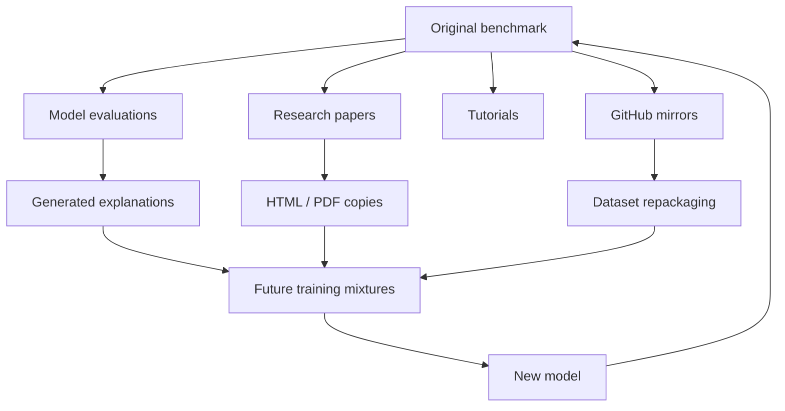

# Hat das Modell argumentiert – oder hat es die Antwort schon einmal gesehen?

**Ein hoher benchmark-Wert kann auf starkes Denken, gute Mustererkennung, zufällige Vertrautheit mit dem Testsatz oder eine unangenehme Kombination aus allen dreien hinweisen.**

---

Ich habe mir einmal ein Modellergebnis angesehen, das fast verdächtig gut war.

Die Aufgabe war nicht unmöglich, aber sie war so schwierig, dass ich eine sichtbare Verteilung der Fehler erwartete: ein paar Rechenfehler, einige brüchige Argumente, vielleicht Verwirrung wegen ungewöhnlicher Formulierungen. Stattdessen bewegte sich das Modell mit bemerkenswerter Sicherheit durch die Beispiele.

Meine erste Reaktion war die erfreuliche: Vielleicht war das Modell einfach besser, als ich erwartet hatte.

Meine zweite Reaktion war weniger bequem:

**Was wäre, wenn es diese Fragen bereits gesehen hätte?**

Diese Frage klingt einfach, aber sie wirft ein überraschend schwieriges Bewertungsproblem auf.

Wenn ein Sprachmodell bei einem benchmark 92 % erreicht, möchten wir diese Zahl natürlich als Beweis für die Leistungsfähigkeit interpretieren. Das Modell verstand die Aufgabe, argumentierte anhand unbekannter Beispiele und gab richtige Antworten.

Aber der benchmark-Score selbst kann uns nicht sagen, *wie* die Antwort zustande kam.

Ein Modell könnte wirklich verallgemeinern.

Es könnte eine sehr bekannte Problemvorlage erkennen.

Es könnte sich an Fragmente einer Antwort aus dem Training erinnern.

Möglicherweise wurde die genaue benchmark-Frage auf GitHub, in einem Papieranhang, in einem benchmark-Repository, in generierten Trainingsdaten oder in den Modellausgaben einer anderen Person gefunden.

Und da es sich bei modernen Trainingskorpora um riesige, teilweise nicht offengelegte, wiederholt gefilterte, deduplizierte, gemischte, regenerierte und destillierte Korpora handelt, ist die Unterscheidung dieser Fälle viel schwieriger als die Überprüfung, ob eine CSV-Datei im Vortrainingsdatensatz enthalten ist.

Der benchmark-Score ist gestiegen.

Ob das Modell intelligenter wurde, ist eine andere Frage.

---

## Ein benchmark geht stillschweigend davon aus, dass das Model die Prüfung nie abgelegt hat

Die meisten Benchmarks basieren auf einem impliziten Versuchsaufbau:

```text
training data
     │
     ▼
┌───────────┐
│   Model   │
└───────────┘
     │
     │ previously unseen task
     ▼
┌───────────┐
│ Benchmark │
└───────────┘
     │
     ▼
  Score
```

Die interessante Größe soll die Fähigkeit des Modells sein, von seinem erlernten Wissen und seinen Mechanismen zu einer Antwort zu gelangen, auf die es noch nie zuvor gestoßen ist.

In der Terminologie des maschinellen Lernens legen wir Wert auf **Verallgemeinerung**.

Betrachten Sie nun eine etwas andere Pipeline:

```text
benchmark
   │
   ├────────► webpage
   ├────────► GitHub repository
   ├────────► paper appendix
   ├────────► tutorial
   └────────► synthetic dataset
                    │
                    ▼
               training corpus
                    │
                    ▼
                 model
                    │
                    ▼
               benchmark
```

Am endgültigen Bewertungsskript ändert sich nichts.

Wir nennen immer noch:

```python
accuracy = evaluate(model, benchmark)
```

und erhalten Sie eine absolut respektable Gleitkommazahl.

Aber seine Interpretation hat sich geändert.

Der Testsatz dient nicht mehr nur dazu, die Übertragung auf unbekannte Beispiele zu testen. Ein Teil könnte stattdessen testen, ob die mit diesen Beispielen verbundenen Informationen das Training überstanden haben.

Das ist benchmark Kontamination in ihrer einfachsten Form.

Leider ist die echte Version chaotischer.

---

## „Hat das Model dieses Beispiel gesehen?“ ist keine binäre Frage

Ein nützliches mentales Modell besteht darin, Kontamination nicht mehr als boolesche Variable zu behandeln.

Es gibt mehrere Ebenen der Vertrautheit.

Stellen Sie sich vor, Sie bewerten diese Frage:

> A shop reduces a €120 item by 25%. What is the new price?

Das Modell könnte auf Folgendes gestoßen sein:

1. **Die genaue Frage und genaue Antwort**
2. Dieselbe Frage mit leicht unterschiedlicher Formatierung
3. Eine umschriebene Version mit „$120“.
4. Dieselbe numerische Struktur mit unterschiedlichen Objekten
5. Tausende Beispiele für Berechnungen von „25 % Rabatt“.
6. Nur das zugrunde liegende mathematische Konzept

Diese Situationen sind nicht gleichwertig.

Letzteres ist genau das, was wir mit dem Training erreichen wollen. Ein Modell sollte allgemeine mathematische Muster anhand von Beispielen lernen.

Die erste Frage kommt einer Antwort aus dem Gedächtnis viel näher.

Die interessanten Fälle sind alles dazwischen.

Dadurch entsteht ein Kontinuum:

```text
Exact memorization
      │
      ▼
Near-duplicate recognition
      │
      ▼
Template familiarity
      │
      ▼
Task familiarity
      │
      ▼
General learned capability
```

Die Grenze zwischen Auswendiglernen und Verallgemeinern ist nicht sauber.

Das ist einer der Gründe, warum die Kontaminationserkennung schwierig wird: Selbst wenn ich das Trainingskorpus perfekt durchsuchen könnte, müsste ich dennoch entscheiden, welcher Grad der Ähnlichkeit eine Bewertung ungültig macht.

---

## Durch die exakte Übereinstimmung wird die leichte Kontamination erfasst

Wenn Trainingsdaten verfügbar sind, besteht der naheliegendste Test darin, nach benchmark-Beispielen zu suchen.

Bei normalisierten Strings kann der erste Durchgang fast peinlich einfach sein:

```python
def normalize(text: str) -> str:
    return " ".join(text.lower().split())

benchmark_question = normalize(question)

if benchmark_question in normalized_training_corpus:
    print("possible contamination")
```

Im größeren Maßstab würde ich es natürlich vermeiden, einen riesigen Korpus linear zu scannen. Sinnvoller sind Hashes, N-Gramm-Indizes, MinHash, ortsabhängiges Hashing oder eine Suchmaschine.

Aber die zugrunde liegende Idee ist einfach.

Eine genaue Überschneidung ist ein nützlicher Beweis.

Es ist auch die einfachste Version des Problems.

Angenommen, der benchmark enthält:

> Which planet is known as the Red Planet?

und die Trainingsdaten enthalten:

> **Q:** What planet is commonly called "the Red Planet"?  
> **A:** Mars.

Beim Matching auf Zeichenebene fehlt dies möglicherweise völlig.

Das Einbetten von Ähnlichkeit könnte dies erkennen, aber jetzt haben wir Schwellenwerte eingeführt.

Wie ähnlich ist verdächtig ähnlich?

Ein Ähnlichkeitswert von „0,96“ ist wahrscheinlich interessant.

Was ist mit „0,83“?

Und wie unterscheiden wir einen kontaminierten benchmark-Eintrag von zwei unabhängig voneinander geschriebenen Fragen zu einer äußerst häufigen Tatsache?

Je besser unser Detektor bei der semantischen Übereinstimmung wird, desto mehr fängt er an, legitime konzeptionelle Ähnlichkeiten zu erkennen.

---

## Öffentliche Benchmarks haben ein seltsames Erfolgsproblem

Ein benchmark wird nützlicher, wenn Leute ihn verwenden.

Leider macht die weit verbreitete Verwendung es auch schwieriger, es als unsichtbaren Test zu bewahren.

Ein erfolgreicher benchmark erscheint in:

- repositories,
- model evaluation harnesses,
- research papers,
- issue discussions,
- tutorials,
- leaderboards,
- Hugging Face datasets,
- blog posts,
- notebooks,
- prompt collections,
- model-generated explanations.

Dann werden diese Seiten zu potenziellen Trainingsdaten.

Selbst wenn ein Modellentwickler das ursprüngliche benchmark-Repository explizit entfernt, können abgeleitete Versionen bestehen bleiben.

Möglicherweise hat jemand den Datensatz von JSON in Markdown konvertiert.

Eine andere Person hat möglicherweise falsche Fragen mit korrigierten Antworten gepostet.

Ein Lehrer hat möglicherweise benchmark-Probleme in Übungen umgewandelt.

Ein Modell hat möglicherweise Erklärungen für jedes benchmark-Element generiert, und diese Erklärungen können später in den Trainingskorpus eines anderen Modells aufgenommen werden.

Hier beginnt das klare Bild „Trainingssatz versus Testsatz“ zu kollabieren.

Daten haben jetzt Abstammung.



Bis zur Evaluierung des Modells kann die Frage, ob es „den benchmark gesehen hat“, die Rekonstruktion einer Datenlieferkette erfordern, die niemand vollständig erfasst hat.

---

## Auswendiglernen sieht nicht immer wie Kopieren aus

Es gibt noch eine andere Annahme, der ich nicht traue:

> If the model memorized the answer, it should reproduce the original text.

Nicht unbedingt.

Neuronale Netze sind keine Datenbanken mit einer praktischen „SELECT * FROM Memories“-Schnittstelle.

Eine gespeicherte Assoziation kann Vorhersagen beeinflussen, ohne dass eine wörtliche Reproduktion erfolgt.

Angenommen, ein Multiple-Choice-Modell sieht Folgendes:

```text
Question X -> option C
```

oft während des Trainings.

Zum Zeitpunkt der Auswertung werden die Auswahlmöglichkeiten neu geordnet.

Wenn das Modell die semantische Antwort gespeichert hat, kann es dennoch erfolgreich sein.

Wenn es sich oberflächliche Positionsmuster merkt, könnte es scheitern.

Wenn es sich teilweise an eine bekannte Erklärung erinnert, kann diese Erinnerung eine Antwort einfach viel wahrscheinlicher machen.

Von außen betrachtet kann dies nicht von einer Argumentation zu unterscheiden sein.

Das bedeutet, dass sich eine Kontamination nicht nur darauf auswirken kann, ob ein Modell eine Antwort kennt, sondern auch, **wie viel Suche es intern durchführen muss, bevor es sie erreicht**.

Ein bekanntes Problem könnte Folgendes hervorrufen:

- shorter reasoning traces,
- unusually high confidence,
- lower sensitivity to distracting information,
- faster convergence to the answer.

Keines dieser Signale beweist das Auswendiglernen.

Aber zusammen können sie zu nützlichen Beweisen werden.

---

## Beunruhigen Sie die Frage und sehen Sie, was überlebt

Ein Experiment, das mir konzeptionell gefällt, ist einfach:

**Stellen Sie die benchmark-Frage nicht nur einmal. Erstellen Sie nahegelegene Versionen davon.**

Angenommen, das ursprüngliche Problem ist:

> Alice has 12 apples. She gives 5 to Bob. How many remain?

Generieren Sie nun Varianten:

### Oberflächenstörung

> Alice owns twelve apples and gives Bob five. How many does she have left?

Die Semantik ist identisch.

### Numerische Störung

> Alice has 17 apples. She gives 8 to Bob.

Gleiche Struktur, andere Antwort.

### Entitätsstörung

> A warehouse contains 12 packages and ships 5.

Gleicher zugrunde liegender Vorgang.

### Strukturelle Störung

> Alice has 12 apples. Bob gives her 5 more.

Jetzt ändert sich die erforderliche Operation.

Eine wirklich robuste Fähigkeit sollte viele semantikerhaltende Änderungen überstehen und korrekt reagieren, wenn sich die Semantik ändert.

Eine auswendig gelernte Assoziation kann viel spröder sein.

Sie können sich die Bewertung weniger so vorstellen, dass Sie eine Frage stellen, sondern eher die Umgebung messen:

\[
f(x), f(x + \delta_1), f(x + \delta_2), \dots
\]

wobei jedes \(\delta\) eine kontrollierte Eigenschaft ändert.

Die interessante Messung ist nicht nur:

```text
Did the model get x right?
```

Aber:

```text
Does its behavior remain consistent under transformations
that should preserve the answer?

Does it change when transformations should change the answer?
```

Dadurch wird die Kontamination nicht gelöst.

Aber es liefert uns viel mehr Informationen als ein einzelner Genauigkeitspunkt.

---

## Der benchmark kann kontaminiert sein, auch wenn die genauen Antworten dies nicht sind

Es gibt einen subtileren Fehlermodus, den ich interessanter finde.

Stellen Sie sich einen benchmark vor, der auf einem bestimmten Argumentationsformat basiert.

Jedes Beispiel enthält eine ungewöhnliche Struktur:

```text
object → relation → transformation → final category
```

Möglicherweise wurden die genauen benchmark-Fragen nie in die Schulung aufgenommen.

Aber Tausende von Lösungen, generierten Beispielen, fine-tuning-Beispielen und benchmark-inspirierten Aufgaben haben es geschafft.

Das Modell kann daher für die Verteilung dieses benchmark extrem optimiert werden.

Ist das eine Kontamination?

Streng genommen vielleicht nicht.

Aber es bedeutet, dass die Leistung uns möglicherweise mehr über die **Vertrautheit mit der Verteilung** verrät als über die Fähigkeit zum umfassenden Denken.

Dies ist wichtig, da Benchmarks oft indirekt zu Trainingszielen werden.

Sobald eine Bestenliste wichtig ist, folgt Optimierungsdruck.

Forscher untersuchen Fehler.

Eingabeaufforderungen sind abgestimmt.

Trainingsmischungen werden angepasst.

Für schwache Kategorien werden synthetische Daten generiert.

Modelle werden basierend auf der Leistung von benchmark ausgewählt.

Auch ohne direkte Schulung der Testantworten passt sich der Entwicklungsprozess schrittweise an die Bewertung an.

Softwareentwickler kennen bereits eine Version dieses Problems.

Wenn ich eine Implementierung wiederholt ändere, bis sie eine festgelegte Testsuite besteht, sind diese Tests irgendwann keine völlig unabhängige Qualitätsmessung mehr.

Der Code könnte sich verbessern.

Aber auch die Testsuite prägt den Code.

Benchmarks verhalten sich ähnlich.

---

## Geheime Testsätze helfen, aber sie führen zu einem weiteren Kompromiss

Die offensichtliche Lösung besteht darin, die Bewertungsdaten privat zu halten.

Das ist attraktiv.

Wenn benchmark-Fragen nach dem Modelltraining generiert oder in einem versteckten Testsatz gespeichert werden, ist eine direkte Kontamination viel unwahrscheinlicher.

Für eine ernsthafte Bewertung würde ich diesem weit mehr als einem Jahrzehnt alten Datensatz vertrauen, der im Internet gespiegelt ist.

Aber private Benchmarks verursachen Kosten.

| Approach | Contamination resistance | Reproducibility | Transparency | Maintenance |
|---|---:|---:|---:|---:|
| Fully public static benchmark | Low | Excellent | Excellent | Low |
| Public train, hidden test | Medium–High | Good | Medium | Medium |
| Continuously refreshed private tests | High | Lower | Lower | High |
| Procedurally generated tasks | Potentially high | Good | Medium | High |
| Human-created post-training evaluation | High | Variable | Medium | Very high |

Ein privater benchmark ist schwieriger zu überprüfen.

Forscher können nicht einfach überprüfen, ob Fragen mehrdeutig sind.

Das Debuggen unerwarteter Fehler wird schwieriger.

Die externe Reproduzierbarkeit nimmt ab.

Und schließlich können auch private Fragen durchsickern.

Die Lösung kann daher nicht einfach darin bestehen, „alles geheim zu halten“.

---

## Eine dynamische Bewertung ist viel schwieriger zu merken

Eine vielversprechendere Richtung ist die Bewertung von **Fähigkeiten, die viele mögliche Testinstanzen generieren**, statt einer festen Sammlung bekannter Fragen.

Anstatt zu speichern:

```text
Question 1
Question 2
Question 3
...
Question 5000
```

Definieren Sie einen Aufgabengenerator:

```python
def generate_problem(rng):
    entities = sample_entities(rng)
    constraints = sample_constraints(rng)
    target = sample_target(rng)

    return build_problem(
        entities=entities,
        constraints=constraints,
        target=target,
    )
```

Jetzt trifft das Modell während der Auswertung auf eine neue Instanz.

Beispielsweise könnte eine Planung benchmark zufällig Folgendes generieren:

- available tools,
- dependencies,
- object states,
- constraints,
- distractors,
- success conditions.

Dies macht das Auswendiglernen nicht irrelevant. Das Modell kann weiterhin die zugrunde liegende Aufgabenfamilie lernen.

Aber genau das wollen wir messen.

Die Bewertung verschiebt sich von:

> Do you remember these 500 tasks?

zu:

> Can you solve new tasks sampled from this capability distribution?

Es gibt einen technischen Haken.

Es ist schwierig, gültige Aufgaben zu generieren.

Wenn der Generator versehentlich unmögliche oder mehrdeutige Fälle erzeugt, messen wir Generatorfehler anstelle der Modellfähigkeit.

Bei Agenten-Benchmarks wird es noch schwieriger, da die Umgebung selbst konsistent bleiben muss.

Bei der dynamischen Bewertung wird also das Kontaminationsrisiko gegen die Komplexität der Infrastruktur ausgetauscht.

Das ist normalerweise ein Handel, zu dem ich bereit bin.

---

## Agenten machen das Problem etwas einfacher – und viel schwieriger

Werkzeuggebrauchende Agenten führen zu einer interessanten Wendung.

Ein Text benchmark endet oft mit einer Antwort:

```text
model → "42"
```

Ein Agent erstellt eine Flugbahn:

```text
observe
  ↓
reason
  ↓
select tool
  ↓
construct arguments
  ↓
observe result
  ↓
update state
  ↓
select next action
```

Selbst wenn ein Agent schon einmal eine ähnliche Aufgabe gesehen hat, reicht es oft nicht aus, sich die endgültige Antwort zu merken.

Es muss immer noch korrekt mit der aktuellen Umgebung interagieren.

Das gibt uns zusätzliche Bewertungssignale:

- Was the correct tool selected?
- Were the arguments valid?
- Did the agent inspect necessary state?
- Did it recover after a failed action?
- Did it respect constraints?
- Did it reach success through a sensible trajectory?

Aber Agenten erzeugen eine neue Form der benchmark-Überanpassung.

Ein Modell kann benchmark-spezifische Werkzeugnamen und Workflow-Konventionen lernen:

```text
search_database()
book_item()
submit_answer()
```

und sehen in dieser Umgebung hervorragend aus.

Benennen Sie die Tools um, ändern Sie das Schema, ordnen Sie Beobachtungen neu oder führen Sie einen unbekannten Zwischenzustand ein, und die Leistung kann stark sinken.

Für Agenten würde ich also nicht nur die Aufgabe variieren.

Ich würde auch Teile der Benutzeroberfläche variieren.

Eine gute Agentenbewertung sollte testen, ob das System Folgendes gelernt hat:

```text
"when I need information, retrieve it"
```

statt:

```text
"benchmark tasks usually begin with calling tool_3"
```

---

## Können wir Kontaminationen allein anhand des Modells erkennen?

Manchmal fehlt uns der Schulungskorpus.

Dies ist bei geschlossenen Modellen häufig der Fall, und selbst offene Modelle liefern möglicherweise keinen vollständig nachverfolgbaren Datensatz.

Dann wird die Frage schwieriger:

**Kann das Modellverhalten Aufschluss darüber geben, ob ein Beispiel auswendig gelernt wurde?**

Es gibt mehrere mögliche Signale.

### Fragen Sie nach ungewöhnlichen Fortsetzungen

Wenn online eine benchmark-Frage mit einer eindeutigen Erklärung vorhanden ist, fordern Sie das Modell mit dem Anfang auf und prüfen Sie, ob es seltene Formulierungen wiedergibt.

Eine starke Fortsetzungsähnlichkeit kann verdächtig sein.

Aber das Fehlen einer Reproduktion beweist fast nichts.

### Messen Sie die Empfindlichkeit gegenüber Störungen

Behalten Sie die Argumentationsstruktur bei, während Sie Werte, Namen, Reihenfolge oder irrelevante Details ändern.

Ein starker Abfall kann darauf hindeuten, dass man sich auf die Vertrautheit mit der Oberfläche verlässt.

Es könnte aber auch eine echte Robustheitsschwäche aufdecken.

### Vergleichen Sie bekannte und neu generierte Aufgaben

Erstellen Sie neue Beispiele, um dieselbe Fähigkeit zu testen.

Wenn die Leistung ist:

```text
public benchmark:       94%
fresh matched problems: 67%
```

Ich würde nachforschen.

Die Lücke ist aussagekräftiger als jede Zahl allein.

### Untersuchen Sie das Selbstvertrauen

Auswendig gelernte Elemente können zu ungewöhnlich sicheren Vorhersagen führen.

Leider ist das Vertrauen in moderne Sprachmodelle so schlecht kalibriert, dass ich dies nur als unterstützenden Beweis betrachten würde.

Keine dieser Methoden ergibt einen magischen Kontaminationsdetektor.

Sie geben uns etwas Realistischeres: **eine Sammlung von Tests, die die Memorisierungshypothese mehr oder weniger plausibel machen können.**

---

## Ich würde aufhören, eine benchmark-Nummer zu melden

Wenn ich ein wichtiges Modell bewerten würde, möchte ich nicht, dass das Hauptergebnis so aussieht:

```text
Benchmark X: 91.7%
```

Diese Zahl ist kompakt.

Es bringt auch viel zu viel Verantwortung mit sich.

Ich würde lieber eine kleine Bewertungsmatrix erstellen.

| Evaluation | Question it answers |
|---|---|
| Original public benchmark | Can the model solve the standard test? |
| Paraphrased items | Is performance robust to surface wording? |
| Counterfactual variants | Does the answer track changed facts? |
| Fresh matched examples | Does performance transfer to unseen instances? |
| Harder compositional variants | Does the learned capability scale? |
| Procedurally generated tasks | Can the model generalize within the task family? |
| Out-of-distribution variants | How brittle is the learned strategy? |

Die interessante Größe wird zur **Form der Leistung unter allen Bedingungen**.

Betrachten Sie zwei hypothetische Modelle:

```text
                 Public    Paraphrase    Fresh    OOD
Model A            95%         93%        91%     78%
Model B            97%         84%        69%     51%
```

Wenn ich nur die erste Kolumne veröffentlichen würde, würde Modell B gewinnen.

Wenn ich ein System wollte, das ungewohnten Eingaben standhalten muss, würde ich wahrscheinlich Modell A wählen.

Genau aus diesem Grund ist Kontamination nicht nur ein Problem der Datensatzhygiene.

Es handelt sich um ein Bewertungsdesignproblem.

---

## Worauf ich eigentlich vertrauen würde

Ich glaube nicht, dass die richtige Antwort darin besteht, jedes öffentliche benchmark für nutzlos zu erklären.

Stabile öffentliche Benchmarks sind immer noch wertvoll.

Sie ermöglichen systemübergreifende Vergleiche.

Sie offenbaren Rückschritte.

Sie machen Forschung reproduzierbar.

Sie geben uns gemeinsame Bezugspunkte.

Ich würde einfach ändern, wie viele Beweise ich benötige, bevor ich eine überzeugende Fähigkeitsbehauptung vorstelle.

Für etwas, dessen Bereitstellung mir wirklich am Herzen lag, würde meine Bewertung drei Ebenen kombinieren.

Erstens würde ich den Standard benchmark beibehalten, weil die Vergleichbarkeit nützlich ist.

Zweitens würde ich kontrollierte Transformationen des benchmark erstellen: Paraphrasen, geänderte Werte, neu angeordnete Optionen, geänderte Entitäten, geänderte Werkzeugschemata oder andere für die Aufgabe geeignete Störungen.

Drittens würde ich neue Bewertungsdaten erstellen, nachdem das Modell und die Eingabeaufforderungskonfiguration korrigiert wurden.

Der letzte Schritt ist wichtig.

Wenn ich einen versteckten Testsatz erzeuge, das Modell auswerte, alle Fehler inspiziere, das System ändere und diesen Vorgang fünfzig Mal wiederhole, ist mein versteckter Satz stillschweigend zu Entwicklungsdaten geworden.

Also würde ich trennen:

```text
development evaluation
        │
        ▼
model / prompt decisions frozen
        │
        ▼
fresh final evaluation
```

Es ist nicht glamourös.

Es handelt sich im Grunde um experimentelle Hygiene.

Aber ein überraschend großer Teil der Modellbewertung wird klarer, wenn man Benchmarks weniger als unveränderliche Maßstäbe für Intelligenz, sondern eher als Softwaretests betrachtet, die durchgesickert, übermäßig angepasst, manipuliert und versehentlich optimiert werden können.

---

## Vielleicht „Begründung oder Auswendiglernen“? ist die falsche Frage

Je mehr ich über Kontamination nachdenke, desto weniger nützlich wird die binäre Frage.

Neuronale Modelle lernen aus Beispielen.

Natürlich wirkt sich eine frühere Exposition auf zukünftige Überlegungen aus.

Menschen arbeiten auf die gleiche Weise: Es ist einfacher, ein bekanntes Problem zu lösen, als eine Strategie von Grund auf neu zu erfinden.

Die wichtige Frage ist nicht, ob das Modell aus ähnlichen Beispielen gelernt hat.

Es sollte.

Die Frage ist, wie weit seine Fähigkeiten über sie hinausgehen.

Funktioniert es immer noch, wenn ich die Namen ändere?

Wenn ich die Zahlen ändere?

Wenn ich eine Beziehung umkehre?

Wenn ich das Tool API ersetze?

Wenn ich morgen eine neue Instanz erstelle, die im Trainingskorpus möglicherweise nicht vorhanden gewesen wäre?

Wenn die Antwort über diese Änderungen hinweg korrekt bleibt, fällt es mir viel leichter, die Verhaltensverallgemeinerung zu nennen.

Eine benchmark sollte daher nicht als Abschlussprüfung mit einer Punktzahl behandelt werden.

Ich stelle es mir lieber als Sonde vor.

Bewegen Sie die Sonde herum.

Ändern Sie die Oberflächenform.

Ändern Sie den zugrunde liegenden Status.

Generieren Sie neue Instanzen.

Schieben Sie etwas außerhalb der bekannten Verteilung.

Beobachten Sie dann, wo die Kompetenz des Modells erhalten bleibt.

Denn der stärkste Beweis dafür, dass ein Modell argumentieren kann, ist nicht, dass es die Antwort auf eine Frage kennt, die wir Modellen seit Jahren stellen.

Wenn wir die Frage genau so ändern, dass das Auswendiglernen nicht überleben sollte, tut dies die Fähigkeit.

---

## Homepage-Auszug

Ein Model erhält eine außergewöhnliche benchmark-Bewertung. Großartig – aber hat es die Probleme gelöst, vertraute Vorlagen erkannt oder sich an den Test erinnert? Der interessante Teil der Bewertung beginnt, wenn eine Zahl nicht mehr ausreicht.

## Schlagworte

„LLM Evaluation“ · „Benchmark-Kontamination“ · „Auswendiglernen“ · „Generalisierung“ · „KI-Robustheit“ · „Sprachmodelle“ · „Agentenbewertung“.

