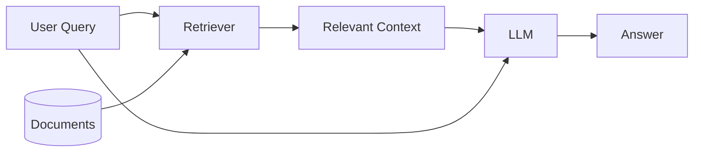
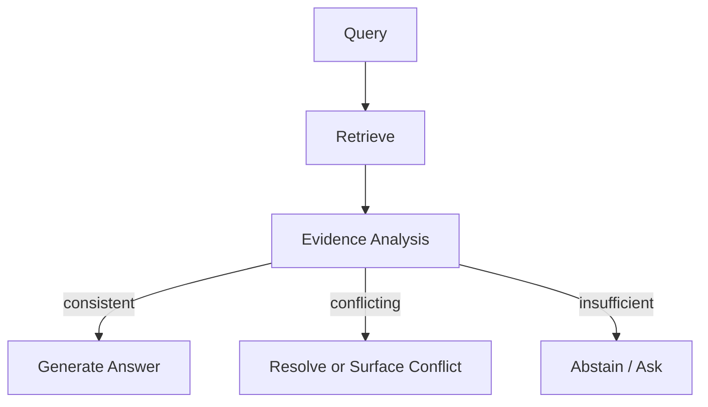

# RAG funktioniert – bis sich die Quellen widersprechen

**Die passenden Dokumente zu finden, ist nur die halbe Arbeit. Schwierig wird es, wenn mehrere passende Quellen unterschiedliche Antworten nahelegen.**

Ich habe einem RAG-System einmal eine Frage gestellt, bei der das Retrieval eigentlich kaum einfacher hätte sein können.

In der Wissensbasis lagen zwei Dokumente zur selben internen API.

Im ersten stand:

> Requests sind auf 100 pro Minute begrenzt.

Im zweiten:

> Requests sind auf 500 pro Minute begrenzt.

Beide Dokumente waren relevant. Beide landeten weit oben im Ranking. Beide wurden zuverlässig gefunden.

Das Modell antwortete:

> Die API unterstützt bis zu 500 Requests pro Minute.

Auf den ersten Blick sah alles richtig aus. Die Antwort war präzise formuliert und ließ sich direkt auf eines der gefundenen Dokumente zurückführen.

Trotzdem war sie falsch.

Die Grenze von 500 Requests stammte aus einer alten Migrationsnotiz. In der aktuellen Spezifikation galt längst ein Limit von 100.

Im klassischen RAG-Stack war dabei eigentlich nichts kaputt. Die Embeddings funktionierten. Das Retrieval funktionierte. Der Kontext passte problemlos ins Context Window. Selbst die konkrete Zahl war nicht erfunden, sondern stand genau so in einer Quelle.

Das eigentliche Problem war eine andere Annahme: **Nur weil ein System relevante Dokumente findet, heißt das noch lange nicht, dass seine Antwort wirklich durch die Quellen gedeckt ist.**

Sobald Dokumente veraltet sind, sich widersprechen, wichtige Bedingungen auslassen oder mehrere Lesarten zulassen, reicht gutes Retrieval nicht mehr aus.

Dann geht es nicht mehr nur darum, *welche* Dokumente gefunden wurden.

Sondern darum, *wie das System mit ihnen umgeht*.

---

## Das übliche RAG-Bild ist ein bisschen zu ordentlich

Ein vereinfachtes RAG-System wird oft ungefähr so dargestellt:



Die Idee dahinter ist schnell erklärt:

1. Finde Dokumente, die zur Frage passen.
2. Gib sie dem Modell.
3. Lass das Modell daraus eine Antwort formulieren.

Damit wirkt Retrieval-Qualität automatisch wie der wichtigste Engpass.

Ist die Antwort schlecht, hat der Retriever vielleicht die falschen Chunks geliefert. Also bessere Embeddings, ein Reranker, andere Chunk-Größen oder schlicht mehr Treffer.

All das kann sinnvoll sein.

Aber nehmen wir an, der Retriever wäre perfekt.

Er findet jedes Dokument, das auch ein Mensch als relevant einstufen würde.

Die Antwort kann trotzdem falsch sein.

Ein realistischeres Bild sieht eher so aus:

```text
query
  |
  v
retrieve candidate sources
  |
  +---- aktuelle Spezifikation
  +---- veraltete Dokumentation
  +---- unvollständige Troubleshooting-Notiz
  +---- Kommentar eines Nutzers
  +---- mehrdeutige Policy-Seite
  |
  v
LLM muss entscheiden:
  - welche Quelle ist maßgeblich?
  - welche ist aktueller?
  - widersprechen sich die Aussagen wirklich?
  - welche Information fehlt?
  - ist eine eindeutige Antwort überhaupt gerechtfertigt?
  |
  v
answer
```

Retrieval entscheidet darüber, **welche Quellen überhaupt auf dem Tisch liegen**.

Es entscheidet nicht darüber, **welcher davon man im Zweifel folgen sollte**.

Genau dieser zweite Schritt bleibt oft unsichtbar, weil Sprachmodelle sehr gut darin sind, aus unordentlichem Kontext eine glatte, eindeutige Antwort zu machen.

Manchmal fast schon zu gut.

---

## Ein Widerspruch ist nicht einfach nur Rauschen

Nehmen wir an, eine interne Wissensbasis enthält diese drei Passagen:

```text
Dokument A — Employee Handbook 2025
Remote Work ist an bis zu drei Tagen pro Woche erlaubt.

Dokument B — HR Policy Update, März 2026
Mitarbeitende dürfen an bis zu zwei Tagen pro Woche remote arbeiten.

Dokument C — Engineering FAQ
Die meisten Engineering-Teams arbeiten aktuell drei Tage pro Woche remote.
```

Die Frage lautet:

> An wie vielen Tagen pro Woche dürfen Mitarbeitende remote arbeiten?

Ein Vektor-Retriever kann problemlos alle drei Dokumente finden.

Aus Retrieval-Sicht ist das ein sehr gutes Ergebnis.

Für die Antwortgenerierung beginnt das eigentliche Problem aber erst jetzt.

Dokument B ist offenbar neuer als A. Gilt es auch für alle Teams?

Dokument C beschreibt eher die Praxis als die offizielle Regel. Ist die FAQ veraltet? Gilt für Engineering eine Ausnahme? Oder wird die neue Policy dort einfach noch nicht umgesetzt?

Eine vernünftige Antwort könnte lauten:

> Laut dem HR-Update vom März 2026 gilt allgemein eine Grenze von zwei Remote-Tagen pro Woche. Die Engineering-FAQ nennt weiterhin drei Tage; sie könnte daher veraltet sein oder eine teamspezifische Ausnahme beschreiben.

Ein typischer RAG-Prompt ist oft viel simpler:

> Beantworte die Frage anhand des bereitgestellten Kontexts.

Damit soll das Modell widersprüchliche Quellen zu einer einzigen Antwort verdichten, ohne dass überhaupt festgelegt wurde, wie solche Konflikte aufzulösen sind.

Vielleicht bevorzugt es die neueste Passage.

Vielleicht die ausführlichste.

Vielleicht einfach die letzte im Kontext.

Oder es bildet implizit eine Art Mehrheitsentscheidung.

Noch problematischer wird es, wenn das Modell aus den drei Aussagen eine neue, sehr plausible Formulierung baut:

> Mitarbeitende arbeiten in der Regel zwei bis drei Tage pro Woche remote.

Das klingt vernünftig.

Nur hat keine Quelle genau das behauptet.

Die Zahlen wurden nicht halluziniert. Beide stehen in den Dokumenten.

Halluziniert wurde vielmehr **der Zusammenhang zwischen den Quellen**.

---

## Relevanz und Verlässlichkeit sind nicht dasselbe

Embedding-basierte Suche optimiert in erster Linie auf semantische Ähnlichkeit.

Das ist gut für die Frage:

> Welche Dokumente haben inhaltlich mit meiner Anfrage zu tun?

Es beantwortet aber nicht automatisch:

> Welcher Quelle sollte ich vertrauen?

Das sind zwei unterschiedliche Probleme.

Nehmen wir eine Suche in technischer Dokumentation:

| Quelle | Relevant? | Aktuell? | Verlässlich? |
|---|---:|---:|---:|
| Aktuelle API-Referenz | Ja | Ja | Hoch |
| Migrationsleitfaden von 2024 | Ja | Nein | Mittel |
| GitHub Issue | Ja | Vielleicht | Niedrig |
| Internes Design-Dokument | Ja | Nein | Mittel |
| Antwort in einem Nutzerforum | Ja | Unklar | Niedrig |

Für ein Embedding-Modell können alle fünf Quellen sehr relevant sein.

Der veraltete Migrationsleitfaden kann sogar *höher* ranken als die aktuelle API-Referenz, wenn seine Formulierung besser zur Nutzerfrage passt.

Daraus ergibt sich eine Trennung, die ich bei RAG-Systemen sehr wichtig finde:

```text
retrieval relevance ≠ source reliability
```

Ich sehe Retrieval deshalb weniger als Schritt, der bereits „die Antwort findet“, sondern eher als Schritt, der **Kandidaten für die spätere Begründung** liefert.

Diese Kandidaten müssen anschließend noch eingeordnet werden.

Plötzlich werden Metadaten wichtig, die im ersten Prototyp oft wie Nebensache aussehen: Zeitstempel, Dokumenttyp, Versionsnummer, Status, zuständiges Team oder Gültigkeitsbereich.

Ein Chunk wie:

```json
{
  "text": "The maximum upload size is 50 MB.",
  "source": "api_reference.md"
}
```

liefert weniger Kontext als:

```json
{
  "text": "The maximum upload size is 50 MB.",
  "source": "api_reference.md",
  "version": "v4.2",
  "effective_date": "2026-05-01",
  "status": "current",
  "authority": "official"
}
```

Für das Embedding machen diese Felder vielleicht kaum einen Unterschied.

Für die spätere Entscheidung, welcher Aussage zu folgen ist, schon.

---

## Veraltete Dokumente sind besonders tückisch

Alte Informationen sind unangenehm, weil sie gleichzeitig perfekt relevant und trotzdem falsch sein können.

Stellen wir uns einen Support-Assistenten mit folgender Frage vor:

> Welche Authentifizierungsmethoden unterstützt der Dienst?

Der Retriever findet:

```text
Dokumentation 2025:
Der Dienst unterstützt Passwort-Authentifizierung und API Keys.
```

und:

```text
Security Update 2026:
Passwort-Authentifizierung wurde deaktiviert.
Verwende OAuth oder API Keys.
```

Ein reiner Relevanzscore kann beide Passagen nahezu gleich bewerten.

Wenn die Evaluation nur prüft, ob die Antwort irgendeine gültige Authentifizierungsmethode nennt, kann das System sogar noch gut abschneiden.

Das ist einer der Gründe, warum RAG-Benchmarks manchmal besser aussehen als reale Systeme.

Viele Benchmark-Aufgaben behandeln Wissen implizit als statisch:

```text
question -> one correct passage -> one correct answer
```

In echten Wissensbasen ist Wissen aber versioniert.

Policies ändern sich.

APIs werden deprecated.

Preise ändern sich.

Projekte werden umbenannt.

Teams schreiben neue Dokumentation, ohne die alte zu löschen.

Damit ist ein Retrieval-Korpus nicht einfach eine Datenbank mit Fakten.

Er ist eher eine Sammlung von **Aussagen, die zu unterschiedlichen Zeitpunkten von unterschiedlichen Quellen gemacht wurden**.

Und das ist deutlich schwieriger zu verarbeiten.

---

## Mehr Kontext kann die Antwort sogar schlechter machen

Wenn ein System unsicher ist, liegt die naheliegende Reaktion oft darin, mehr Dokumente abzurufen.

Top-3 reicht nicht? Dann Top-10.

Top-10 reicht nicht? Dann eben noch mehr Kontext.

Das verbessert den Recall.

Aber mehr Recall führt nicht automatisch zu besseren Antworten.

Nehmen wir an, der Korpus enthält:

```text
2 aktuelle Dokumente
4 veraltete Dokumente
3 Forum-Diskussionen
1 spekulativen Design-Vorschlag
```

Alle zehn Texte erwähnen dasselbe Feature.

Top-2 könnte genau die beiden aktuellen Dokumente liefern und damit zu einer korrekten Antwort führen.

Top-10 liefert dagegen die komplette Historie aller Aussagen, die zu diesem Feature jemals gemacht wurden — inklusive der inzwischen falschen.

Das Modell hat nun mehr Informationen.

Aber auch eine deutlich schwierigere Aufgabe.

Ich denke dabei gern an **Context Dilution**: Mehr Kontext ist nur dann hilfreich, wenn das System auch zuverlässig unterscheiden kann, welche Teile davon tatsächlich zählen.

Das Problem ist also nicht nur, dass irrelevante Chunks Tokens verbrauchen.

Auch relevante, aber widersprüchliche Informationen machen die Aufgabe schwerer.

Als grobes Denkmodell:

```text
answer quality
    =
retrieval coverage
    ×
evidence resolution quality
```

Wenn man nur die Retrieval-Abdeckung erhöht und ignoriert, wie das Modell Konflikte zwischen Quellen auflöst, bringt „mehr Kontext“ irgendwann keinen Vorteil mehr.

In manchen Fällen schadet es sogar.

---

## Unvollständige Quellen sind fast das Gegenstück dazu

Bei widersprüchlichen Dokumenten sieht man den Konflikt wenigstens.

Bei unvollständigen Informationen sieht zunächst alles plausibel aus.

Angenommen, in einem Dokument steht:

> Enterprise-Kunden dürfen Audit Logs exportieren.

Der Nutzer fragt:

> Kann ich Audit Logs exportieren?

Die Passage passt perfekt.

Ein Modell könnte antworten:

> Ja, Audit Logs können exportiert werden.

Aber vielleicht nutzt der aktuelle Nutzer nur den Free-Tarif.

Die Aussage im Dokument war nicht falsch.

Sie war nur an eine Bedingung geknüpft.

Was fehlt, ist die Information, ob diese Bedingung im konkreten Fall erfüllt ist.

Die eigentliche Struktur ist:

```text
Enterprise(user) -> CanExportLogs(user)
```

Die Quelle liefert aber nur die Regel.

Nicht die zusätzliche Voraussetzung:

```text
Enterprise(current_user)
```

RAG-Systeme überspringen diesen Unterschied erstaunlich oft.

Gerade bei Berechtigungen, Voraussetzungen, Ausnahmen oder Prozessregeln wird das schnell problematisch.

Die bessere Antwort wäre:

> Enterprise-Kunden können Audit Logs exportieren. Aus den vorliegenden Informationen geht allerdings nicht hervor, ob dein Account dazu berechtigt ist.

Das klingt weniger entschieden.

Ist aber deutlich besser belegt.

---

## Perfektes Retrieval löst keine mehrdeutige Frage

Es gibt noch eine andere Fehlerklasse: Die Dokumente sind korrekt und vollständig, aber die Nutzerfrage selbst lässt mehrere Interpretationen zu.

Nehmen wir eine Engineering-Wissensbasis mit zwei Bedeutungen von „Memory“:

```text
Memory:
Langfristiger Conversation Storage des Agents.

Memory:
GPU-Speicherbedarf während der Inferenz.
```

Dann fragt jemand:

> Wie viel Memory braucht das System?

Der Retriever kann beide Themen korrekt finden.

Das ist kein Retrieval-Fehler.

Die Frage ist schlicht nicht eindeutig.

Ein Modell, das darauf optimiert ist, immer eine direkte Antwort zu geben, entscheidet sich möglicherweise stillschweigend für eine der beiden Bedeutungen.

Ein robusteres System sollte erkennen, wenn die gefundenen Quellen zu mehreren plausiblen Interpretationen passen.

Daraus ergibt sich für mich eine einfache Regel:

> Manchmal ist die beste Antwort eine Rückfrage.

RAG-Systeme werden oft so evaluiert, als wäre eine Rückfrage oder ein bewusstes „Das lässt sich aus den Quellen nicht eindeutig sagen“ automatisch ein Fehler.

Im Produktivbetrieb kann genau das ein Zeichen dafür sein, dass das System mit Unsicherheit vernünftig umgeht.

---

## Retrieval und Quellenbewertung würde ich getrennt testen

Wenn ich ein RAG-System für den produktiven Einsatz evaluieren würde, würde ich nicht bei Recall@K oder Answer Accuracy aufhören.

Ich würde bewusst Fälle bauen, in denen das Retrieval funktioniert und das eigentliche Problem erst danach beginnt.

Zum Beispiel:

| Test | Gefundene Dokumente | Erwartetes Verhalten |
|---|---|---|
| Konsistente Quellen | Mehrere übereinstimmende Dokumente | Klar antworten |
| Aktuell vs. veraltet | Zwei Versionen derselben Policy | Aktuelle Quelle bevorzugen |
| Unterschiedliche Autorität | Forum vs. offizielle Doku | Offizielle Quelle bevorzugen |
| Echte Mehrdeutigkeit | Zwei plausible Interpretationen | Rückfrage stellen |
| Fehlende Bedingung | Regel bekannt, Nutzerstatus unbekannt | Einschränkung offen nennen |
| Direkter Widerspruch | Gleichwertige Quellen widersprechen sich | Widerspruch sichtbar machen |
| Irreführende Mehrheit | 1 aktuelle + 5 veraltete Quellen | Nicht nach Mehrheit entscheiden |
| Keine ausreichende Grundlage | Verwandte Dokumente, aber keine klare Antwort | Keine Sicherheit vortäuschen |

Die Trennung, die mich dabei interessiert, ist:

```text
Hat das System die richtigen Informationen gefunden?

versus

Hat es mit diesen Informationen richtig gearbeitet?
```

Das sollten zwei verschiedene Messgrößen sein.

Sonst landen Retrieval-Fehler und Reasoning-Fehler in derselben Accuracy-Zahl, und man weiß am Ende nur, *dass* etwas nicht funktioniert hat — aber nicht, *wo*.

---

## Was ich an der Architektur ändern würde

Für widersprüchliche Quellen gibt es keinen einzelnen Fix.

Ein paar Maßnahmen helfen aber sehr zuverlässig.

### 1. Metadaten schon beim Retrieval nutzen

Veraltete Dokumente kann man oft bereits vor der semantischen Suche herausfiltern.

Zum Beispiel:

```python
results = vector_store.search(
    query,
    filters={
        "status": "current",
        "product_version": current_version
    }
)
```

Das ist günstig, deterministisch und effektiv.

Der Haken ist offensichtlich: Die Metadaten müssen stimmen.

Wenn Versionierung und Dokumentenpflege schlecht sind, übernimmt das RAG-System dieses Chaos einfach.

### 2. Nicht nur nach semantischer Ähnlichkeit reranken

Ein zweiter Ranking-Schritt kann zusätzliche Signale berücksichtigen:

- semantische Relevanz,
- Veröffentlichungsdatum,
- Verlässlichkeit der Quelle,
- Dokumentstatus,
- Produktversion,
- Gültigkeitsbereich.

Als Denkmodell:

```text
score =
    relevance
  + authority
  + freshness
  + scope_match
```

Ich würde das nicht zwingend als echte lineare Formel implementieren.

Als mentale Trennung ist es aber hilfreich.

Eine Quelle kann hochrelevant und trotzdem ungeeignet für die finale Antwort sein.

### 3. Widersprüche explizit prüfen

Für wichtigere Anwendungen würde ich zwischen Retrieval und Antwortgenerierung einen zusätzlichen Schritt einbauen, der die gefundenen Aussagen miteinander vergleicht.



Dieser Schritt kann zum Beispiel prüfen auf:

- unterschiedliche Zahlenwerte,
- widersprüchliche Policy-Aussagen,
- Versionskonflikte,
- sich gegenseitig ausschließende Claims,
- fehlende Voraussetzungen.

Das kostet zusätzliche Latenz und möglicherweise einen weiteren Modellaufruf.

Wenn das System sonst selbstbewusst eine falsche Berechtigungsregel oder eine alte Refund Policy ausgibt, ist dieser zusätzliche Call aber oft gut investiert.

### 4. Erst Claims strukturieren, dann Fließtext schreiben

Eine Architektur, die ich konzeptionell sinnvoll finde, trennt diese Arbeit stärker auf:

```text
documents
    ↓
extract supported claims
    ↓
attach provenance
    ↓
resolve claim relationships
    ↓
generate final answer
```

Das Modell muss dann nicht gleichzeitig lesen, vergleichen, Schlussfolgerungen ziehen und bereits eine schön formulierte Antwort schreiben.

Zum Beispiel:

```json
[
  {
    "claim": "Remote work limit is 3 days/week",
    "source": "handbook_2025",
    "status": "superseded"
  },
  {
    "claim": "Remote work limit is 2 days/week",
    "source": "policy_2026",
    "status": "current"
  }
]
```

Die finale Generierung bekommt dadurch ein deutlich saubereres Problem.

Natürlich steigt dafür die Pipeline-Komplexität.

Und jede zusätzliche Komponente ist am Ende auch eine weitere Stelle, an der etwas schiefgehen kann.

Das gehört wohl einfach dazu.

---

## Das Modell sollte sagen dürfen: „Die Quellen widersprechen sich“

Eine der wirksamsten Maßnahmen ist gleichzeitig ziemlich unspektakulär: Man ändert, was überhaupt als gute Antwort gilt.

Wenn ein Modell immer eine einzige eindeutige Antwort liefern soll, wird Unsicherheit schnell in Sicherheit umformuliert.

Ich würde ausdrücklich Antworten erlauben wie:

> Die gefundenen Quellen widersprechen sich.

> Das neuere Dokument sagt X, während eine ältere Quelle Y nennt.

> Aus den verfügbaren Informationen lässt sich nicht erkennen, ob diese Bedingung im aktuellen Fall erfüllt ist.

> Die Frage lässt zwei plausible Interpretationen zu.

Damit ändert sich das Ziel.

Das System soll nicht mehr einfach nur *eine Antwort produzieren*.

Es soll **die tatsächliche Quellenlage korrekt wiedergeben**.

Für mich ist das eine deutlich bessere Definition von Grounding.

---

## Was ich tatsächlich bauen würde

Für eine kleine interne RAG-Anwendung würde ich nicht sofort eine aufwendige mehrstufige Reasoning-Pipeline bauen.

Ich würde mit den langweiligen Dingen anfangen:

1. saubere Dokumentversionierung,
2. brauchbare Metadaten,
3. Metadata Filtering,
4. Reranking,
5. sichtbare Quellenangaben,
6. die Möglichkeit, Unsicherheit offen zu benennen,
7. ein Evaluationsset mit bewusst widersprüchlichen Fällen.

Danach würde ich die abgerufenen Chunks zusammen mit den generierten Antworten loggen.

Nicht nur bei offensichtlichen Fehlern.

Auch bei vermeintlich erfolgreichen Antworten.

Besonders interessant wären für mich Fälle, in denen der Retriever widersprüchliche Informationen liefert und das Modell daraus eine verdächtig glatte Antwort macht.

Solche Beispiele sagen oft mehr über die Robustheit eines Systems aus als ein kompletter Retrieval-Ausfall.

Für sensiblere Anwendungen — etwa Policy-Assistenten, technischen Support, Finanz-Workflows oder Tool-Using Agents — würde ich zusätzlich eine explizite Konfliktauflösung und Herkunftsverfolgung der Aussagen einbauen.

Und ich würde mindestens drei Dinge getrennt messen:

```text
retrieval correctness
evidence interpretation correctness
final answer correctness
```

Eine einzige End-to-End-Accuracy-Zahl versteckt dafür einfach zu viel.

---

## Grounding ist ein Verhalten, kein Context Window

Früher habe ich Grounding bei RAG vor allem räumlich gedacht.

Die relevante Information musste **im Context Window stehen**.

Wenn sie dort war, hatte das Modell Zugriff auf die Wahrheit.

Aber Zugriff ist nicht dasselbe wie Grounding.

Eine Antwort ist erst dann wirklich gut durch die Quellen gedeckt, wenn das System stärkere Quellen gegenüber schwächeren priorisiert, Bedingungen berücksichtigt, Widersprüche erkennt, zeitliche Änderungen einordnet und offen sagt, wenn die vorhandenen Dokumente keine eindeutige Aussage zulassen.

Damit ähnelt Grounding weniger einer Dokumentensuche und mehr einem disziplinierten Umgang mit Quellen.

Der Retriever kann seine Arbeit perfekt machen und dem Modell trotzdem zwei unterschiedliche Versionen derselben Realität liefern.

Dann lautet die interessante Frage nicht mehr:

> Haben wir das richtige Dokument gefunden?

Sondern:

> Weiß das System, was es tun soll, wenn sich die richtigen Dokumente widersprechen?

---

## Kurztext für die Startseite

Ein RAG-System kann genau die richtigen Dokumente finden und trotzdem falsch antworten. Veraltete Quellen, widersprüchliche Versionen, fehlende Bedingungen und Mehrdeutigkeit machen Grounding zu mehr als nur einem Retrieval-Problem.

## Tags

`RAG` · `LLM` · `Retrieval-Augmented Generation` · `LLM Evaluation` · `AI Engineering` · `Grounding` · `Robustness`
