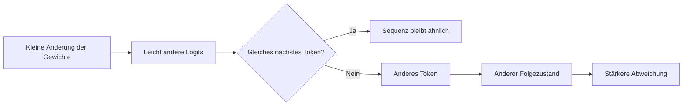

# Was bei der Quantisierung eines LLMs wirklich verloren geht

*Ein quantisiertes Modell kann deutlich weniger Speicher brauchen und im Benchmark trotzdem fast genauso gut aussehen. Interessant wird es dort, wo sich das Verhalten verändert, bevor der Durchschnittsscore etwas davon zeigt.*

Lange habe ich Quantisierung vor allem als Deployment-Thema gesehen.

Modell in FP16 laden, Speicher messen. Dann dieselbe Variante in 8 Bit oder 4 Bit laden, noch einmal messen und ein paar Benchmarks laufen lassen. Wenn die Werte kaum schlechter werden, scheint die Sache erledigt.

In der Praxis ist es komplizierter.

Ein quantisiertes Modell kann im Durchschnitt fast genauso gut abschneiden wie die höherpräzise Version und sich trotzdem genau an den Stellen verändern, die für ein reales System wichtig sind: bei mehrstufigen Anweisungen, strukturierten Ausgaben, knappen Entscheidungen, seltenen Tokens, langen Generierungen oder bei der Auswahl eines Tools.

Das Problem ist nicht, dass Quantisierung ein Modell plötzlich unbrauchbar macht. Meist passiert etwas viel Unspektakuläreres: Viele kleine numerische Entscheidungen verschieben sich ein wenig.

Fast immer ist das egal.

Manchmal liegt die Entscheidung aber genau auf der Kippe. Dann reicht eine kleine Verschiebung, damit das Modell ein anderes Token auswählt – und ab diesem Punkt kann sich die gesamte weitere Generierung anders entwickeln.

Deshalb interessiert mich weniger die Frage:

> Wie viel Accuracy verliert ein Modell bei 4 Bit?

Spannender ist:

> **Welche Teile des Modellverhaltens werden instabiler, wenn wir Präzision reduzieren – und sind genau diese Teile für unsere Anwendung relevant?**

Damit ist Quantisierung nicht nur eine Frage der Kompression.

Sie ist auch eine Frage der Evaluation.

## Der Speichervorteil ist eindeutig

Der einfachste Teil ist der Speicherbedarf.

Wenn man zunächst nur die Gewichte betrachtet, gilt grob:

\[
\text{Speicher} \approx N \times \text{Bits pro Parameter}
\]

Für ein Modell mit sieben Milliarden Parametern ergibt das in FP16 ungefähr:

\[
7 \times 10^9 \times 16 \text{ Bit}
\approx 14 \text{ GB}
\]

Bei 8 Bit sind es etwa 7 GB, bei 4 Bit etwa 3,5 GB.

In einem echten Inferenzsystem kommen natürlich noch weitere Komponenten dazu: Quantisierungs-Metadaten, temporäre Buffer, Aktivierungen, KV-Cache und Laufzeitzustand. Die Werte oben sind also nicht mit dem gesamten GPU-Speicherverbrauch gleichzusetzen.

Trotzdem ist der Unterschied enorm.

| Gewichtsformat | Speicher für 7B Parameter, grob | Relativ zu FP16 |
|---|---:|---:|
| FP32 | 28 GB | 2× |
| FP16 / BF16 | 14 GB | 1× |
| INT8 | 7 GB | 0,5× |
| INT4 | 3,5 GB | 0,25× |

Dieser Unterschied entscheidet oft darüber, was praktisch möglich ist.

Ein Modell, das vorher nur knapp auf eine große GPU passt, lässt sich plötzlich mit Reserve betreiben. Ein kleineres Modell kann lokal auf einem Laptop laufen. Und manche Anwendungen, die zuvor zwingend auf eine externe API angewiesen waren, werden damit überhaupt erst für On-Device-Inferenz interessant.

Genau deshalb ist Quantisierung so attraktiv.

Der Effekt auf den Speicher ist sofort sichtbar.

Leider ist Speicher auch die Kennzahl, bei der man sich am wenigsten täuschen kann.

## Quantisierung macht aus vielen Werten weniger Werte

Die einfachste Vorstellung von Quantisierung ist: Viele fein abgestufte Zahlen werden auf eine kleinere Menge darstellbarer Werte abgebildet.

Nehmen wir zum Beispiel diese Gewichte:

```text
0.137
0.141
0.148
0.905
-0.332
```

In höherer Präzision lassen sich diese Werte relativ genau darstellen.

In niedrigerer Präzision könnte daraus näherungsweise werden:

```text
0.14
0.14
0.14
0.91
-0.35
```

Für sich genommen sieht keine dieser Abweichungen dramatisch aus.

Bei Milliarden von Parametern ist das Modell danach trotzdem nicht mehr numerisch identisch.

Vereinfacht kann man Quantisierung etwa so schreiben:

\[
q = \text{round}\left(\frac{x}{s}\right)
\]

und die Rekonstruktion als:

\[
\hat{x} = s q
\]

Dabei ist \(s\) ein Skalierungsfaktor und \(q\) der quantisierte Wert.

In der Praxis sind moderne Verfahren deutlich raffinierter. Sie arbeiten zum Beispiel mit Group-wise- oder Per-Channel-Scaling, behandeln Ausreißer separat, verwenden nichtlineare Wertebereiche, Kalibrierungsdaten oder Mixed Precision.

Der Grund dafür ist einfach:

**Nicht jedes Gewicht verträgt denselben Approximationsfehler.**

Einige Werte können sich deutlich verändern, ohne dass man es am Output merkt.

Andere sind empfindlicher.

Und welche davon kritisch sind, erkennt man nicht zuverlässig, indem man nur auf die Gewichte schaut.

## Weniger Bits bedeuten nicht automatisch weniger Latenz

Wenn ein Modell von FP16 auf INT4 schrumpft, liegt eine Annahme nahe:

Weniger Speicher müsste auch deutlich schnellere Inferenz bedeuten.

Manchmal stimmt das.

Aber längst nicht immer.

Eine vereinfachte Inferenzpipeline sieht eher so aus:

```text
       Quantisierte Gewichte
                │
                ▼
      ┌─────────────────────┐
      │ Aus Speicher laden  │
      └──────────┬──────────┘
                 │
                 ▼
      ┌─────────────────────┐
      │ Dequantisierung /   │
      │ Kernel-Ausführung   │
      └──────────┬──────────┘
                 │
                 ▼
      ┌─────────────────────┐
      │ Aktivierungen       │
      └──────────┬──────────┘
                 │
                 ▼
             Nächstes Token
```

Quantisierung reduziert den Speicherverkehr. Das ist wichtig, weil autoregressives Decoding oft stark durch Speicherbandbreite begrenzt wird.

Aber der Datentyp allein entscheidet nicht über die Laufzeit.

Die Runtime braucht effiziente Kernel für genau das Quantisierungsformat, das verwendet wird. Manche GPUs sind für INT8 sehr gut optimiert, aber deutlich weniger für bestimmte 4-Bit-Formate. Gewichte müssen eventuell entpackt oder während der Berechnung dequantisiert werden. Auch Batch-Größe und Sequenzlänge verändern das Verhalten.

Dann kommt der KV-Cache dazu.

Gewichte in 4 Bit bedeuten nicht automatisch einen viermal kleineren KV-Cache. Bei langen Kontexten kann genau dieser Cache einen großen Teil des Speichers belegen.

Deshalb würde ich bei einem Inferenzvergleich mindestens diese vier Werte getrennt messen:

- Speicher direkt nach dem Laden;
- Peak Memory während der Inferenz;
- Time to First Token;
- Tokens pro Sekunde beim Decoding.

Ein Modell kann beim Speicher massiv gewinnen und beim Durchsatz fast gleich bleiben.

Mit ungünstigen Kernels kann eine niedrigere Präzision sogar langsamer sein.

„4 Bit“ beschreibt ein Format.

Noch kein Inferenzsystem.

## Ein ähnlicher Durchschnitt bedeutet nicht dasselbe Verhalten

Angenommen, ein Benchmark liefert:

FP16: 78,4 %.

INT4: 78,1 %.

0,3 Prozentpunkte Unterschied sehen harmlos aus.

Vielleicht sind sie es auch.

Aber nehmen wir an, beide Modelle werden auf denselben 1.000 Beispielen getestet.

Selbst wenn beide ungefähr 780 Antworten richtig haben, heißt das nicht, dass es dieselben 780 sind.

Zum Beispiel:

| Aufgabentyp | FP16 | INT4 |
|---|---:|---:|
| Häufige Wissensfragen | 95 % | 95 % |
| Einfache Klassifikation | 91 % | 91 % |
| Mehrstufige Anweisungen | 82 % | 78 % |
| JSON-Generierung | 94 % | 88 % |
| Seltene Fachbegriffe | 71 % | 65 % |
| Gesamt | 86,6 % | 83,4 % |

Noch aussagekräftiger ist ein gepaarter Vergleich:

```text
FP16 richtig, INT4 richtig:     720
FP16 falsch,  INT4 falsch:      140
FP16 richtig, INT4 falsch:       80
FP16 falsch,  INT4 richtig:      60
```

Im Gesamtscore liegen nur 20 Beispiele zwischen den Modellen.

Bei **140 Beispielen** verhalten sie sich aber unterschiedlich.

Das ist die interessantere Zahl.

Ein Durchschnittsscore kann fast gleich bleiben, obwohl sich einzelne Entscheidungen an vielen Stellen verschieben.

Für manche Anwendungen ist das egal.

Für einen Agenten, der zwischen `read_database` und `delete_record` wählen muss, eher nicht.

## Kleine Logit-Verschiebungen können eine ganze Sequenz kippen

Besonders deutlich wird das bei autoregressiver Generierung.

Angenommen, das höherpräzise Modell hat für das nächste Token diese Verteilung:

```text
"approve"     0.41
"reject"      0.39
"request"     0.12
...
```

Nach der Quantisierung könnte daraus werden:

```text
"approve"     0.39
"reject"      0.41
"request"     0.12
...
```

Numerisch ist der Unterschied winzig.

Das ausgewählte Token ist aber ein anderes.

Und damit ändert sich auch der Kontext für das nächste Token.

Dann für das nächste.

Und so weiter.



In den meisten Fällen passiert nichts.

Wenn ein Token klar dominiert, bleibt es auch nach einer kleinen numerischen Verschiebung dominant.

Interessant sind die knappen Fälle.

Wenn zwei Tokens, Aktionen oder Interpretationen fast gleichauf liegen, kann die Quantisierung entscheiden, welcher Pfad genommen wird.

Damit hängt die Quantisierungsempfindlichkeit nicht nur vom Modell ab.

Sie hängt auch davon ab, welche Aufgaben wir ihm geben.

## Nicht jede Fähigkeit ist gleich robust

Wenn ich ein quantisiertes Modell für ein reales System testen würde, wäre ein einzelner allgemeiner Benchmark für mich nur der Anfang.

Mich würden vor allem Aufgaben interessieren, bei denen kleine Änderungen später große Folgen haben.

Strukturierte Ausgabe ist ein gutes Beispiel.

Ein Agent soll etwa Folgendes erzeugen:

```json
{
  "tool": "search_products",
  "arguments": {
    "query": "wireless keyboard"
  }
}
```

Bei normalem Text sind viele Formulierungen gleichwertig.

Eine API-Schnittstelle ist weniger großzügig.

Ein zusätzlicher Satz vor dem JSON, ein falscher Enum-Wert, ein fehlendes Pflichtfeld oder ein kaputtes Anführungszeichen kann aus einer semantisch fast richtigen Antwort einen Laufzeitfehler machen.

Ähnlich ist es bei Nebenbedingungen.

Zum Beispiel:

> Fasse das Dokument zusammen, aber gib keine personenbezogenen Informationen aus.

Das Modell kann weiterhin gut zusammenfassen und trotzdem genau diese Zusatzbedingung etwas häufiger verletzen.

Auch bei Long-Context-Aufgaben können sich Verschiebungen anders zeigen. Das Modell „versteht“ den Text weiterhin, gewichtet aber schwache Evidenz möglicherweise anders und lässt einen Distraktor gewinnen.

Seltene Tokens und Fachbegriffe sind ebenfalls interessante Kandidaten, weil die Entscheidungsmargen dort oft kleiner sind.

Das sind keine universellen Regeln.

Aber genau deshalb reicht „Qualität“ als einzelne Kennzahl nicht aus.

## Bei Agenten kostet ein kleiner Fehler mehr

Bei freier Textgenerierung führt ein anderes Token vielleicht nur zu einem anders formulierten Satz.

Bei einem Tool-Using-Agenten kann ein anderes Token eine Aktion auslösen.

Ein einfacher Loop könnte so aussehen:

```text
Nutzeranfrage
    ↓
LLM wählt Tool
    ↓
Tool verändert Zustand
    ↓
LLM sieht Ergebnis
    ↓
LLM wählt nächstes Tool
```

Damit ist das Modell Teil eines Systems, das seinen eigenen zukünftigen Kontext verändert.

Wenn Quantisierung den ersten Tool Call verändert, können auch alle späteren Beobachtungen anders aussehen.

Zum Beispiel:

```text
FP16
search_inventory
→ inspect_item
→ ask_user_confirmation
→ purchase_item

INT4
search_inventory
→ inspect_item
→ purchase_item
```

Aus Sicht eines klassischen Benchmarks haben beide Modelle die Aufgabe verstanden.

Aus Sicht einer Agent-Evaluation hat eines davon einen notwendigen Bestätigungsschritt ausgelassen.

Deshalb finde ich Aussagen wie diese oft zu ungenau:

> Das quantisierte Modell behält 99 % der ursprünglichen Performance.

99 % von **was**?

Perplexity?

Multiple Choice?

Human Preference?

Tool-Call-Success?

Constraint Satisfaction?

End-to-End Task Completion?

Safety Compliance?

Das sind unterschiedliche Eigenschaften.

Und Quantisierung muss sie nicht im gleichen Maß beeinflussen.

## „4 Bit“ ist keine vollständige Konfiguration

Auch die Quantisierungsmethode selbst macht einen großen Unterschied.

Man kann nur Gewichte quantisieren oder zusätzlich Aktivierungen. Man kann unterschiedliche Group Sizes wählen. Empfindliche Layer können in höherer Präzision bleiben. Man kann Post-Training Quantization einsetzen oder Quantization-Aware Training.

Auch die Kalibrierungsdaten spielen eine Rolle.

Grob sieht der Trade-off so aus:

| Ansatz | Vorteil | Nachteil |
|---|---|---|
| FP16/BF16 | Gute Referenzqualität, einfache Nutzung | Hoher Speicherbedarf |
| INT8 | Gute Kompression bei meist moderatem Qualitätsverlust | Weniger Speichergewinn |
| 4-Bit Weight-Only | Sehr starke Speicherreduktion | Stärker abhängig vom Verfahren |
| Mixed Precision | Empfindliche Teile bleiben präziser | Mehr Konfigurationsaufwand |
| Quantization-Aware Training | Modell kann sich an niedrige Präzision anpassen | Zusätzliche Trainingskosten |

Ein typisches Problem sind Ausreißer.

Angenommen, fast alle Gewichte in einer Gruppe liegen zwischen -0,2 und 0,2, aber ein einzelner Wert liegt bei 4,8.

Wenn die gesamte Gruppe dieselbe Skala nutzt, beansprucht dieser Ausreißer einen großen Teil des verfügbaren Wertebereichs. Die vielen kleinen Werte werden dadurch gröber dargestellt.

Group-wise Quantization und Outlier-Aware-Verfahren versuchen genau solche Effekte zu begrenzen.

Deshalb kann die Aussage

> Ich habe das Modell in 4 Bit getestet.

technisch erstaunlich wenig aussagen.

## Ein Benchmark kann Entwarnung geben und trotzdem zu wenig testen

Der Test, dem ich für ein reales Deployment am wenigsten vertrauen würde, wäre:

```text
1. Benchmark auf FP16.
2. Benchmark auf INT4.
3. Durchschnitt vergleichen.
4. Deployen.
```

Der Test ist nicht falsch.

Er beantwortet nur zu wenige Fragen.

Für eine reale Anwendung würde ich zusätzlich eine kleine, gezielte Test-Suite bauen.

Für einen Agenten zum Beispiel:

```text
✓ Richtiges Tool ausgewählt
✓ Pflichtargumente vollständig
✓ Verbotene Tools vermieden
✓ Bestätigung eingeholt, wenn nötig
✓ JSON-Schema eingehalten
✓ Mehrstufige Anweisungen befolgt
✓ Relevante Long-Context-Evidenz genutzt
✓ Verhalten über mehrere Runs stabil
```

Dann würde ich dieselben Prompt-IDs durch beide Modellvarianten laufen lassen.

Gerade dieser paarweise Vergleich ist wichtig, weil er nicht nur zeigt, **wie viel** sich verändert, sondern **wo**.

Wenn möglich, würde ich auch die Entscheidungsmargen anschauen.

Ein Modell kann dieselbe Aufgabe noch richtig lösen, aber von einer klaren Präferenz zu einer Fast-Gleichverteilung rutschen.

Der Output ist dann noch korrekt.

Die Robustheit möglicherweise nicht mehr.

Und ich würde nicht nur Greedy Decoding testen.

Sampling, längere Generierungen und wiederholte Agent-Loops können Unterschiede sichtbar machen, die ein deterministischer Benchmark verschluckt.

## Was ich vor einem 4-Bit-Deployment wirklich messen würde

Ich würde zwei Gruppen von Metriken getrennt betrachten.

Die Systemseite:

```text
Speicher
├── Modellgewichte
├── Peak GPU Memory
└── KV-Cache-Wachstum

Latenz
├── Ladezeit
├── Time to First Token
└── Tokens pro Sekunde

Betrieb
├── Zielhardware
├── Kernel-Support
└── Verhalten bei verschiedenen Batch-Größen
```

Und die Verhaltensseite:

```text
Verhalten
├── Task Success
├── Instruction Following
├── Strukturierte Ausgabe
├── Tool Selection
├── Constraint Adherence
├── Long-Context-Verhalten
└── Run-to-Run-Stabilität
```

Erst zusammen ergeben diese Werte ein brauchbares Bild.

Ein hypothetisches Ergebnis könnte etwa so aussehen:

| Metrik | BF16 | INT8 | INT4 |
|---|---:|---:|---:|
| GPU-Speicher | 15,2 GB | 8,6 GB | 5,1 GB |
| Decode-Speed | 42 tok/s | 51 tok/s | 57 tok/s |
| General Eval | 78,4 | 78,3 | 77,9 |
| Tool Success | 91,0 % | 90,8 % | 87,4 % |
| Gültiges JSON | 98,7 % | 98,5 % | 94,1 % |

Die Zahlen sind erfunden.

Aber genau so eine Tabelle würde mir bei einer Entscheidung helfen.

Für einen lokalen Summarizer auf einem Laptop wäre INT4 vielleicht sofort attraktiv.

Für einen Agenten, der teure oder irreversible Aktionen auslösen kann, können ein paar Gigabyte weniger Speicher den Verlust an Tool-Zuverlässigkeit schnell nicht mehr wert sein.

Es gibt keine universell richtige Präzision.

Nur eine Präzision, die zu den Anforderungen des Systems passt.

## Ich behandle Quantisierung inzwischen wie einen Modellwechsel

Das ist wahrscheinlich das nützlichste mentale Modell, das ich aus solchen Vergleichen mitnehme.

Quantisierung wirkt zunächst wie eine Infrastruktur-Optimierung.

Ähnlich wie ein anderer Kernel, ein anderes Backend oder ein kleineres Container-Image.

Aber die Gewichte ändern sich.

Damit ändert sich auch das Modell.

Meist nur geringfügig.

Aber ausreichend, dass ich eine quantisierte Variante eher wie einen neuen Checkpoint behandeln würde als wie dieselbe Modellversion mit kleinerem Speicherbedarf.

Das bedeutet: Die relevanten Evaluationen müssen noch einmal laufen.

Nicht jede Benchmark-Suite, die es gibt.

Sondern genau die Tests, die das reale System abbilden.

Wenn Function Calling wichtig ist, teste Function Calling.

Wenn Long-Context-Retrieval wichtig ist, teste Long-Context-Retrieval.

Wenn Safety-Regeln entscheidend sind, teste genau diese Regeln.

Und wenn die Quantisierung wegen Latenz eingeführt wird, miss die Latenz auf der tatsächlichen Zielhardware.

Der häufigste Denkfehler ist, das Offensichtliche zu messen – weniger Speicher – und daraus abzuleiten, dass der Rest ebenfalls besser oder zumindest unverändert bleibt.

Das ist oft zu optimistisch.

## Ein 4-Bit-Modell ist nicht viermal schlechter

Ein Modell von FP16 auf 4 Bit zu bringen bedeutet natürlich nicht, dass drei Viertel seiner Fähigkeiten verschwinden.

Neuronale Netze sind erstaunlich robust gegenüber numerischer Approximation.

Sonst würde aggressive Quantisierung überhaupt nicht funktionieren.

Gerade diese Robustheit kann aber irreführend sein.

Die interessanten Fehler sehen selten so aus:

> Das Modell kann plötzlich keine Sprache mehr.

Sie sehen eher so aus:

> Die Aufgabe funktioniert weiterhin, aber eine Nebenbedingung wird deutlich öfter verletzt.

Oder:

> Der Benchmark ist praktisch unverändert, aber die beiden Modellvarianten widersprechen sich bei überraschend vielen Einzelfällen.

Oder:

> Der Speicherverbrauch sinkt stark, die Latenz aber kaum, weil die Zielhardware das verwendete Quantisierungsformat nicht besonders gut unterstützt.

Oder bei einem Agenten:

> Alles wirkt stabil, bis ein knappes Token anders ausfällt, ein anderes Tool gewählt wird und sich danach der gesamte Trajektorienverlauf verschiebt.

Das ist für mich die interessantere Antwort auf die Frage, was bei Quantisierung eigentlich verloren geht.

Nicht unbedingt „Intelligenz“.

**Eher Spielraum, Stabilität und manchmal die Sicherheit, dass sich das System noch genauso verhält wie vorher.**

---

## Kurztext für die Startseite

Quantisierung kann den Speicherbedarf eines LLMs massiv senken, ohne den Benchmark-Score stark zu verändern. Trotzdem können Tool-Nutzung, strukturierte Ausgaben, Latenz und Verhaltensstabilität deutlich anders reagieren.

## Tags

`LLM` · `Quantisierung` · `Modelloptimierung` · `LLM-Evaluation` · `AI Agents` · `Inference` · `Machine Learning Systems`
