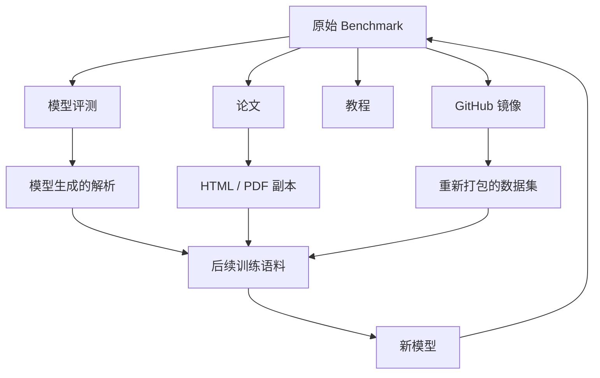

# 模型是真的会推理，还是只是见过这道题？

**一个漂亮的 Benchmark 分数，可能说明模型确实更强了；也可能只是说明，这道题、这个模板，甚至这份答案，对它来说早就不陌生。**

---

有些评测结果，好得会让人本能地多看一眼。

任务本身并不简单。正常情况下，我会预期模型在某些地方出错：算错一步，遇到不常见的表述时变得不稳定，或者在几个边界案例里选了一条看起来合理、其实并不成立的捷径。

但有时候，模型几乎一路全对。

不仅正确率高，而且回答很快、很稳，甚至稳得有点反常。

第一反应通常是：这个模型确实比预期更强。

但很快就会出现第二个问题：

**它是真的会做，还是以前见过？**

这其实是今天做 LLM 评测时一个很难绕开的麻烦。

当一个模型在某个 Benchmark 上拿到 92% 的准确率，我们很容易把这个数字直接理解成“能力”：它理解了任务，把训练时学到的东西迁移到了新问题上，然后给出了正确答案。

问题是，这个分数本身并不会告诉我们，模型**为什么答对**。

它可能真的完成了泛化。

也可能只是认出了一个很熟悉的题型。

它可能记住了某段答案、某种解题模板，甚至直接见过这道题。

而这道题也许曾经出现在 GitHub、论文附录、教程、数据集镜像、模型生成的解析里，最后又重新进入了某一轮训练语料。

到了今天的大模型训练规模，这种事情很难完全追踪。

数据会被抓取、清洗、去重、重混、合成，再拿去做微调、蒸馏或者二次训练。很多时候，问一句“这份 CSV 有没有进训练集”已经远远不够。

Benchmark 分数提高了。

但模型到底有没有真的变得更强，是另一回事。

---

## Benchmark 默认了一件很重要的事

大多数 Benchmark 背后，都藏着一个很朴素的前提：

```text
训练数据
   │
   ▼
┌───────────┐
│   模型    │
└───────────┘
   │
   │ 从未见过的任务
   ▼
┌───────────┐
│ Benchmark │
└───────────┘
   │
   ▼
  分数
```

我们真正想测的是：

**模型能不能把训练中学到的能力，迁移到一个没见过的新例子上。**

也就是泛化。

但现实中的数据流，可能更接近这样：

```text
Benchmark
   │
   ├────────► 网页
   ├────────► GitHub 仓库
   ├────────► 论文附录
   ├────────► 教程
   └────────► 合成数据
                  │
                  ▼
               训练语料
                  │
                  ▼
                 模型
                  │
                  ▼
              Benchmark
```

评测代码完全没变。

我们还是可以写：

```python
accuracy = evaluate(model, benchmark)
```

然后得到一个看起来非常干净的数字。

变的是这个数字的含义。

它不再只表示“模型能不能解决没见过的问题”。

其中一部分，可能只是“模型对这类内容已经非常熟悉”。

这就是最直观的 Benchmark contamination，也就是基准污染。

真正麻烦的地方在于，实际情况通常没有这么干净。

---

## “见过”并不是一个 yes / no 问题

判断模型有没有见过一道题，听起来像是一个二元问题。

其实不是。

在“完全陌生”和“逐字背过”之间，还有很大一片灰区。

比如这道题：

> 一件 120 欧元的商品打七五折，最后价格是多少？

模型在训练时可能见过：

1. **一模一样的问题和答案**
2. 同一道题，只是排版不同
3. 换了一种说法，但本质完全一样
4. 相同的计算结构，只是换了数字和物体
5. 大量类似的打折题
6. 只学过百分比计算本身

这几种情况显然不能放在一起看。

第 6 种，其实正是我们希望模型学会的。

它应该从大量例子里抽象出一般规律。

第 1 种则更接近直接记住。

真正难判断的是中间几层。

```text
精确记忆
   │
   ▼
近重复识别
   │
   ▼
模板熟悉
   │
   ▼
任务分布熟悉
   │
   ▼
一般能力
```

这里没有一条特别清楚的边界。

哪怕我真的拿到了完整训练语料，我还是得回答另一个问题：

**相似到什么程度，才算这个 Benchmark 已经被污染？**

这也是为什么污染检测远比“搜一下有没有原题”复杂。

---

## 精确匹配只能抓到最简单的情况

如果训练数据公开，最直观的办法当然是搜 Benchmark。

最简单的检查甚至可以写成这样：

```python
def normalize(text: str) -> str:
    return " ".join(text.lower().split())

benchmark_question = normalize(question)

if benchmark_question in normalized_training_corpus:
    print("possible contamination")
```

数据量大以后，当然不会真的线性扫描整个语料。

可以用 hash、n-gram 索引、MinHash、LSH，或者直接上搜索引擎。

但思路没有变。

如果能找到完全一致的匹配，那肯定值得警惕。

问题是，这只能抓到最容易的那一层。

比如 Benchmark 里写的是：

> Which planet is known as the Red Planet?

而训练数据里出现的是：

> **Q:** What planet is commonly called "the Red Planet"?  
> **A:** Mars.

普通字符串匹配很可能什么都找不到。

那换成 embedding 做语义匹配呢？

当然可以。

但新问题马上就来了：

相似度多高才算可疑？

`0.96` 很危险。

那 `0.83` 呢？

如果两个问题讨论的是一个非常常见的事实，又怎么判断是污染，还是只是独立写出了相似的问题？

越强的语义匹配方法，越容易把正常的知识重叠也一起抓出来。

所以这并不是“换个更聪明的检索器”就能解决的问题。

---

## 一个 Benchmark 越成功，反而越容易失去“陌生感”

这件事有点反直觉。

一个 Benchmark 越流行，越有价值。

因为越多人用，模型之间越容易比较。

但也正因为越多人用，它越难继续保持“模型从未见过”。

一个常用 Benchmark 最后通常会出现在很多地方：

- GitHub 仓库
- evaluation harness
- 论文和附录
- issue 和讨论帖
- 教程
- Leaderboard
- Hugging Face 数据集
- Notebook
- Prompt 集合
- 模型自动生成的答案和解析

而这些内容以后又可能重新进入训练语料。

哪怕开发者刻意过滤了原始 Benchmark 仓库，也不代表所有派生版本都被过滤掉了。

有人可能把 JSON 转成 Markdown。

有人可能把题目整理成博客。

有人把错误答案修正以后重新发布。

课程里可能把原题改成作业。

另一个模型也许给整套 Benchmark 生成了解析，几年后这些解析又变成新模型的训练数据。

走到这一步以后，“训练集”和“测试集”之间那条原本很干净的边界就开始变得模糊。

数据会自己传播，也会不断变形。



最后再拿这个模型去跑原来的 Benchmark 时，“它有没有见过？”可能已经不是一个简单的数据检索问题，而是一个几乎没法完整追踪的数据传播链问题。

---

## 记住答案，不一定会表现成“复制答案”

还有一个很容易误判的地方：

> 如果模型真的背过，它应该会把原文复现出来。

不一定。

神经网络不是一个可以直接执行 `SELECT * FROM memories` 的数据库。

一段训练中的记忆，可能只是在概率上让某个答案变得更容易被选出来。

比如一道选择题在训练数据里经常以这种形式出现：

```text
Question X -> option C
```

评测时把选项顺序打乱。

如果模型记住的是**语义上的正确答案**，它依然可能答对。

如果它学到的只是“这种题经常选 C”这种浅层模式，那它可能立刻失效。

如果它只记住了解析里的部分信息，这些信息也可能已经足够，让某个候选答案的概率显著上升。

从外部看，这些情况都可能很像“推理”。

所以污染影响的，不只是模型**知不知道答案**。

它甚至可能影响模型**到达答案的方式**。

一个很熟悉的问题，可能会表现成：

- reasoning trace 更短
- 置信度异常高
- 对干扰信息不敏感
- 很快锁定一个答案

这些信号单独看都不能证明模型在背题。

但如果它们同时出现，就会很值得继续查。

---

## 真要测的话，我更喜欢直接改题

如果是实际做评测，我很喜欢一个简单办法：

**不要只测原题，围绕原题生成一组受控变体。**

比如原题是：

> Alice 有 12 个苹果，给了 Bob 5 个，还剩多少？

可以做几类改动。

### 只改表述

> Alice 原本有十二个苹果，后来给了 Bob 五个。她现在还有几个？

语义完全不变。

### 改数字

> Alice 有 17 个苹果，给了 Bob 8 个。

结构没变，但答案变了。

### 改实体

> 仓库里有 12 个包裹，发出了 5 个。

底层运算还是一样。

### 改结构

> Alice 有 12 个苹果，Bob 又给了她 5 个。

这次连真正需要的运算都变了。

如果模型真的掌握了能力，那么面对“语义不变”的改写，它应该基本稳定。

而当语义发生变化时，它也应该跟着正确调整。

如果模型主要依赖一个熟悉模板，通常会更脆。

可以把这种评测理解成：不是只测一个点，而是在原问题周围测一小片区域。

\[
f(x), f(x + \delta_1), f(x + \delta_2), \dots
\]

每个 \(\delta\) 都只改一个受控因素。

这样一来，我们真正关心的不再只是：

```text
原题答对了吗？
```

而是：

```text
题意没变时，模型是否稳定？

题意真的变了以后，
模型是否也跟着正确变化？
```

这依然不能直接证明“有没有污染”。

但它比一个孤立的 Accuracy 数字有信息得多。

---

## 有时候没有原题泄露，Benchmark 也已经“太熟了”

还有一种更隐蔽的情况。

假设一个 Benchmark 有非常固定的结构：

```text
对象 → 关系 → 变换 → 最终类别
```

具体测试题可能从来没进过训练数据。

但围绕这个 Benchmark，已经产生了大量：

- 解析
- 合成样本
- Fine-tuning 数据
- Prompt 模板
- 相似任务
- 专门针对薄弱项生成的数据

最后，模型可能已经对这个任务分布非常熟悉。

这算不算污染？

严格说，也许不算。

但这个 Benchmark 此时测出来的，可能更多是**对任务分布的熟悉程度**，而不是更广义的推理能力。

一旦某个 Benchmark 变成 Leaderboard 上的重要指标，这种情况几乎不可避免。

大家会看错误案例。

调 Prompt。

改训练数据配比。

针对弱项补合成数据。

甚至直接根据这个 Benchmark 的表现来选模型。

即使没有人直接在测试答案上训练，整个开发流程也会慢慢围绕这个 Benchmark 调整。

这个问题其实软件工程里早就有。

如果我不停修改代码，直到一个固定测试集全部通过，那到某个阶段以后，这个测试集就不再是完全独立的质量指标。

代码可能真的变好了。

但测试本身也在塑造代码。

Benchmark 也是一样。

---

## 把测试集藏起来，有帮助，但不是万能解

最自然的解决办法是：

不要公开测试集。

这当然有效。

如果评测问题是在模型训练之后才生成，或者测试集始终保持私有，那么直接污染的风险会低很多。

如果是一个比较严肃的能力评测，我确实会更信任这种设计，而不是一个已经在网上流传了十年的公开数据集。

但隐藏测试集也有代价。

| 方案 | 抗污染能力 | 可复现性 | 透明度 | 维护成本 |
|---|---:|---:|---:|---:|
| 完全公开的静态 Benchmark | 低 | 很高 | 很高 | 低 |
| 公开训练集 + 隐藏测试集 | 中高 | 较好 | 中等 | 中等 |
| 持续更新的私有测试 | 高 | 较低 | 较低 | 高 |
| 程序生成任务 | 潜力高 | 较好 | 中等 | 高 |
| 训练后人工设计评测 | 高 | 不稳定 | 中等 | 很高 |

私有 Benchmark 很难被外部检查。

别人不容易判断里面有没有歧义、错误或者不合理题目。

模型出现异常表现时，也更难定位原因。

复现性同样会变差。

而且私有测试也不是永远安全。

只要用得够久，就有泄露的可能。

所以“把一切都藏起来”不是完整答案。

---

## 动态评测更难被背下来

我更看好的一种方向，是少依赖固定题库，多用**动态生成任务实例**。

不是提前准备：

```text
问题 1
问题 2
问题 3
...
问题 5000
```

而是写一个生成器：

```python
def generate_problem(rng):
    entities = sample_entities(rng)
    constraints = sample_constraints(rng)
    target = sample_target(rng)

    return build_problem(
        entities=entities,
        constraints=constraints,
        target=target,
    )
```

评测时再生成新的实例。

比如 Planning 类任务，可以随机变化：

- 可用工具
- 依赖关系
- 当前状态
- 约束
- 干扰项
- 成功条件

这样做并不是让记忆彻底失效。

模型依然可以学会这类任务的结构。

但这恰恰是我们希望它学到的。

问题从：

> 你记得这 500 道题吗？

变成了：

> 你能不能解决这个任务分布里新生成的问题？

当然，这会把一部分压力转移到评测基础设施上。

好的任务生成器其实很难写。

如果它随机出了矛盾、无解或者模糊的任务，那最后测到的就不是模型能力，而是 Benchmark 自己的 bug。

Agent 评测还更麻烦。

因为环境状态、工具行为和动作结果都必须保持一致。

所以动态评测本质上是一个 trade-off：

**用更多工程复杂度，换更低的污染风险。**

对于真正重要的评测，我通常觉得这个交换是值得的。

---

## 到了 Agent，问题反而更有意思

Tool-using Agent 和普通文本 Benchmark 有一个很大的不同。

传统文本任务通常最后只看一个输出：

```text
模型 → "42"
```

而 Agent 给出来的是一整条轨迹：

```text
观察
  ↓
判断
  ↓
选择工具
  ↓
填写参数
  ↓
读取结果
  ↓
更新状态
  ↓
继续行动
```

这意味着，即使 Agent 以前见过相似任务，只记住最终答案通常也不够。

它还是要正确地和当前环境交互。

因此我们可以额外看很多东西：

- 工具选对了吗？
- 参数是否合法？
- 有没有先读取必要状态？
- 工具调用失败后能不能恢复？
- 有没有违反约束？
- 最后是不是通过一条合理轨迹完成任务？

这对评测来说是好事。

但 Agent 同时也带来另一种过拟合。

模型可能并没有真正学会“什么时候应该获取信息”，而只是学会了这个 Benchmark 里常见的工具名和工作流。

比如它习惯了：

```text
search_database()
book_item()
submit_answer()
```

在原环境里看起来非常强。

结果把工具改个名字，Schema 换一下，Observation 顺序改一下，或者加一个没见过的中间状态，性能就突然掉下去。

所以在 Agent 评测里，我不仅会改任务本身。

我还会改**接口**。

真正想测的应该是：

```text
“缺信息时，要先去获取信息”
```

而不是：

```text
“这个 Benchmark 一般先调用 tool_3”
```

---

## 如果根本不知道训练数据呢？

现实里，这其实很常见。

Closed-source 模型几乎都是这样。

即使是开放模型，训练数据的完整来源链也不一定能完全追踪。

这时候问题就变成：

**能不能只看模型行为，判断它是不是记住了某些题？**

没有一个特别可靠的单点方法，但有些信号还是值得看。

### 看它会不会补出罕见原文

如果某个 Benchmark 问题在网上有一段很独特的标准解释，可以给模型前半段，看看它会不会继续补出后面的罕见措辞。

如果高度一致，当然值得怀疑。

但如果没有复现，也不能说明它没见过。

### 看它对改写有多敏感

改数字、名字、选项顺序或者无关细节，同时保持底层逻辑不变。

如果性能掉得很厉害，可能说明模型过度依赖表面特征。

当然，也可能只是暴露了一个真正的鲁棒性问题。

### 用新题对照旧题

重新生成一批同类型、同难度的新问题。

如果结果是：

```text
公开 Benchmark：94%
新生成同类任务：67%
```

那我一定会继续查。

这个差值往往比任意一个单独分数都更值得看。

### 置信度只能当辅助信号

模型遇到记忆过的题，可能会异常自信。

但 LLM 本身的置信度校准就不算可靠，所以我不会只凭这一点下结论。

这些方法都不是“记忆检测器”。

它们更像是在不断增加或削弱一种解释：

**这个模型是不是因为太熟悉这些题，才表现得这么好？**

---

## 我不太愿意只看一个 Benchmark 分数

如果我要认真评估一个模型，我不太希望最终报告只写一句：

```text
Benchmark X: 91.7%
```

这个数字很方便。

但它承担了太多解释责任。

我更愿意看一组互相补充的结果。

| 评测方式 | 我真正想知道什么 |
|---|---|
| 原始公开 Benchmark | 模型能不能做好标准测试？ |
| 改写版本 | 是否对表述变化稳定？ |
| 反事实变体 | 事实变化后，答案是否跟着变化？ |
| 新生成的同类问题 | 能不能迁移到真正没见过的新实例？ |
| 更复杂的组合问题 | 学到的策略能不能继续扩展？ |
| 程序生成任务 | 是否能在任务家族内泛化？ |
| OOD 变体 | 离开熟悉分布后会有多脆？ |

这样一来，我更关心的是**不同条件下的性能形状**，而不是最高的那个点。

比如两个模型：

```text
                 Public    Paraphrase    Fresh    OOD
Model A            95%         93%        91%     78%
Model B            97%         84%        69%     51%
```

如果只看第一列，Model B 赢。

但如果我要把系统放进一个真实、不可预测的环境里，我大概率会选 Model A。

所以在我看来，Benchmark contamination 并不只是一个“数据没清干净”的问题。

它本质上还是一个**评测设计问题**。

---

## 真正上线前，我会更信什么

我并不觉得公开 Benchmark 没用了。

它们依然很重要。

因为它们提供了：

- 模型之间的可比性
- 回归测试
- 公共参考点
- 一定程度的可复现性

问题只是，我们不应该让一个分数承担太多能力结论。

如果是一个我真的准备部署的系统，我至少会做三层评测。

第一层，保留标准 Benchmark。

因为横向比较还是有价值。

第二层，对 Benchmark 做受控变体。

比如改写、换数字、重排选项、替换实体、改工具 Schema，或者做其他和任务相关的 perturbation。

第三层，在模型和 Prompt 配置都冻结以后，再创建一批新的最终评测数据。

这里有个细节很重要。

如果我做了一个“隐藏测试集”，然后反复跑模型、看错误、改系统，再继续用同一份隐藏测试集验证，那它迟早会变成开发集。

所以我会明确拆开：

```text
开发阶段评测
      │
      ▼
冻结模型与 Prompt
      │
      ▼
新的最终评测
```

这其实没什么神秘的。

就是实验设计里最基本的卫生习惯。

但很多 LLM 评测问题，一旦把 Benchmark 当成“会泄露、会被过拟合、会被不知不觉优化”的软件测试来看，就会清楚很多。

---

## 也许“推理还是记忆”本来就是个错误的二选一

想得越多，我越觉得“模型到底是在推理，还是在记忆”这个问题本身有点过于二元。

模型本来就是从例子里学东西的。

见过相似问题以后，更容易解决新问题，本身并不是坏事。

人也是一样。

做过十次类似题，当然比第一次见更容易。

所以真正该问的，不是：

> 模型有没有从相似例子里学到东西？

它当然应该学到。

更值得关心的是：

**这种能力到底能带出去多远？**

换掉名字，还能不能做？

换数字呢？

把关系反过来呢？

把工具 API 换掉呢？

如果明天生成一个训练时根本不存在的新实例，它还能不能做？

如果这些变化以后，能力依然稳定，我才更愿意把它叫做泛化。

所以我不太喜欢把 Benchmark 当成一场只有一个总分的期末考试。

我更愿意把它当成一个探针。

往左挪一点。

换一种表述。

改一下底层状态。

生成新的实例。

再稍微走出熟悉分布。

然后看看模型的能力到底在哪些地方还能站得住。

因为一个模型最有说服力的“会推理”证据，并不是它答对了一个已经被问了很多年的经典 Benchmark 问题。

而是当我们把问题改到“纯记忆应该失效”的程度以后，它依然能做对。

---

## 首页摘要

一个模型拿到了很高的 Benchmark 分数，但它是真的会做，还是只是对这类题太熟？真正有意思的评测，往往从“一个分数不够用了”开始。

## 标签

`LLM 评测` · `Benchmark 污染` · `记忆与泛化` · `模型鲁棒性` · `大语言模型` · `Agent 评测` · `AI 系统`
