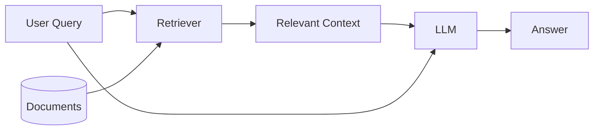
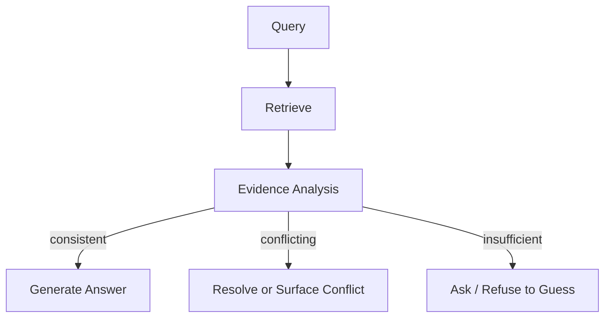

# RAG 一切正常，直到文档开始互相矛盾

**相关文档找对了，不代表答案就一定对。真正棘手的是：当这些文档彼此冲突时，模型到底该相信哪一个。**

我之前给一个 RAG 系统出过一道几乎没有检索难度的问题。

知识库里有两份关于同一个内部 API 的文档。

第一份写着：

> 每分钟最多 100 个请求。

第二份写着：

> 每分钟最多 500 个请求。

两份文档都高度相关，也都排在检索结果前面。换句话说，Retriever 的工作做得没什么问题。

模型最后回答：

> 这个 API 每分钟最多支持 500 个请求。

这句话看起来甚至很“有依据”。

500 不是模型凭空编出来的，而是确实写在检索到的文档里；回答也足够具体，甚至可以把对应来源一起展示出来。

但它还是错了。

500 这个限制来自一份已经过期的迁移说明。当前正式规范里写的是 100。

这类错误很有意思，因为传统意义上的 RAG 组件其实都没有失效。

Embedding 正常。

检索正常。

上下文长度也完全够。

模型甚至引用了真实存在的信息。

真正出问题的是另一个默认假设：

**只要相关文档已经被检索出来，模型就会“基于这些文档”得出正确答案。**

实际并不是这样。

一旦知识库里同时存在新旧版本、互相矛盾的说明、缺失的前置条件，或者同一个问题有不止一种解释，问题就不再只是“找到了什么”。

更重要的是：

**模型会如何判断这些被找出来的信息。**

---

## 我们平时画的 RAG 流程图，往往太干净了

一个最常见的 RAG 流程大概是这样：



背后的逻辑很直观：

1. 找到和问题相关的文档；
2. 把这些文档放进上下文；
3. 让模型根据上下文回答。

所以做 RAG 时，我们很自然会把注意力放在检索质量上。

回答不对？

也许是 chunk 切得不好。

也许 embedding 不够强。

也许 Top-K 太小。

于是我们会换 embedding，加 reranker，调 chunk size，或者干脆多取几条结果。

这些当然都可能有效。

但假设 Retriever 已经足够好了呢？

假设它确实把一个人类也会认为“相关”的文档全都找出来了，系统依然可能答错。

真实一点的流程，其实更接近这样：

```text
query
  |
  v
retrieve candidate sources
  |
  +---- 当前正式规范
  +---- 已过期文档
  +---- 不完整的故障排查记录
  +---- 用户评论
  +---- 含义模糊的政策说明
  |
  v
LLM 还要继续判断：
  - 哪个来源更权威？
  - 哪个版本更新？
  - 它们是真的冲突，还是适用范围不同？
  - 有没有关键条件缺失？
  - 现在是否足以给出明确答案？
  |
  v
answer
```

Retriever 决定的是：

**哪些材料能够进入上下文。**

它没有决定：

**这些材料彼此矛盾时，到底该听谁的。**

而这一层往往被低估了。

因为语言模型特别擅长一件事：哪怕输入本身很乱，它也能整理出一句流畅、完整、听起来很确定的话。

有时候，这反而是最危险的地方。

---

## 文档冲突，不只是“多了一点噪声”

假设一个公司的内部知识库里有三份文档：

```text
文档 A — 2025 Employee Handbook
每周最多可以远程办公 3 天。

文档 B — 2026 年 3 月 HR Policy Update
员工每周最多可以远程办公 2 天。

文档 C — Engineering FAQ
目前大多数工程团队每周远程办公 3 天。
```

现在用户问：

> 每周可以远程办公几天？

一个向量检索器把这三份文档都找出来，是完全合理的。

从 Recall 的角度看，甚至可以说表现很好。

但真正的问题，从这一步才开始。

B 比 A 新，所以应该优先看 B 吗？

可 C 又说工程团队实际上还是 3 天。

那 C 是旧 FAQ？是团队例外？还是新的 HR Policy 根本没有覆盖 Engineering？

一个更稳妥的回答应该是：

> 2026 年 3 月的 HR 更新规定，一般情况下每周最多远程办公 2 天。不过 Engineering FAQ 仍然写着 3 天，因此它可能已经过期，也可能反映了团队层面的例外安排。

问题在于，很多 RAG Prompt 并没有要求模型这样处理。

它通常只会写：

> 请根据以下上下文回答用户问题。

于是模型被要求把互相不一致的内容压成一个答案，却没有明确的冲突处理规则。

它可能偏向最新文档。

可能偏向写得最详细的那一份。

也可能只是受最后一个 chunk 影响更大。

甚至可能把几个结果“揉”成一个新结论：

> 员工通常每周可以远程办公 2 到 3 天。

这句话听起来非常合理。

但没有任何一份文档真的这么说。

这里最值得注意的是：

模型并没有传统意义上“编造数字”。

2 和 3 都来自真实文档。

它真正编造的是：

**这些数字之间的关系。**

---

## “相关”与“可信”，本来就是两个问题

Embedding 检索最擅长回答的是：

> 哪些文档和这个问题在语义上接近？

但真正回答问题时，我们通常还需要解决另一个问题：

> 哪个来源更值得相信？

这两件事并不等价。

比如检索一个 API 的使用规则：

| 来源 | 相关性 | 是否最新 | 可信度 |
|---|---:|---:|---:|
| 当前 API Reference | 高 | 是 | 高 |
| 2024 Migration Guide | 高 | 否 | 中 |
| GitHub Issue | 高 | 不确定 | 低 |
| 内部 Design Proposal | 高 | 否 | 中 |
| 用户论坛回答 | 高 | 不确定 | 低 |

从 embedding 的角度看，这几份内容都可能非常相关。

甚至那份已经过期的 Migration Guide，因为措辞和用户问题更接近，排名还可能高于正式 API Reference。

所以做 RAG 时，我越来越觉得需要明确区分：

```text
retrieval relevance ≠ source reliability
```

Retriever 找到的更像是一批**候选依据**，而不是“答案本身”。

这些候选依据还需要进一步判断。

这时候，一些在早期原型里很容易被忽略的元数据，就会突然变得重要：

- 发布时间；
- 文档版本；
- 当前状态；
- 来源类型；
- 维护团队；
- 适用范围。

例如：

```json
{
  "text": "The maximum upload size is 50 MB.",
  "source": "api_reference.md"
}
```

和：

```json
{
  "text": "The maximum upload size is 50 MB.",
  "source": "api_reference.md",
  "version": "v4.2",
  "effective_date": "2026-05-01",
  "status": "current",
  "authority": "official"
}
```

对 embedding 来说，这些字段可能没那么重要。

但对后面的判断来说，它们非常关键。

---

## 过期文档最麻烦的地方，是它们往往“非常相关”

旧信息有一个很讨厌的特点：

**它可以和问题高度相关，同时又已经完全不适用于现在。**

比如用户问：

> 这个服务现在支持哪些认证方式？

Retriever 找到了两段：

```text
2025 文档：
支持密码登录和 API Key。
```

以及：

```text
2026 Security Update：
密码登录已经下线。
请使用 OAuth 或 API Key。
```

这两段对问题都高度相关。

如果只看 semantic similarity，分数甚至可能差不多。

如果评测又比较粗，只检查回答里有没有提到“API Key”，这个系统甚至还能拿到不错的分数。

这也是为什么很多 RAG Benchmark 看起来比真实系统健康得多。

不少 benchmark 默认的是一种静态世界：

```text
question -> one correct passage -> one correct answer
```

但真实知识库从来不是静态的。

政策会变。

API 会 deprecated。

价格会调整。

项目会改名。

团队会更新文档。

旧页面却不一定会及时删除。

所以一个真实的知识库，与其说是“事实数据库”，不如说更像：

**不同来源在不同时间留下的一组陈述。**

这两者的难度完全不是一个量级。

---

## 多检索一点，结果不一定更好

当系统不确定时，一个很自然的反应是多检索一点。

Top-3 不够？那 Top-10。

Top-10 还不放心？那就把上下文窗口再塞满一点。

这样确实能提高 Recall。

但 Recall 变高，并不代表最终回答一定会变好。

假设知识库里有：

```text
2 份当前文档
4 份过期文档
3 个论坛讨论
1 份尚未落地的设计方案
```

它们都提到了同一个功能。

如果 Top-2 正好拿到两份当前文档，模型很可能直接答对。

但 Top-10 会把这个功能过去几年所有对过、错过、改过的说法一起塞给模型。

模型拥有的信息变多了。

问题也变难了。

我比较喜欢把这种现象理解成 **Context Dilution**。

真正的问题不只是“无关信息浪费 token”。

更麻烦的是：

**相关但互相冲突的信息，也会增加模型的判断负担。**

可以用一个很粗的思路理解：

```text
answer quality
    =
retrieval coverage
    ×
evidence resolution quality
```

如果只一味提高检索覆盖率，却不管模型怎么处理冲突，那么“多取一点上下文”迟早会到达收益上限。

有些时候，甚至会把答案拉低。

---

## 信息不完整，是另一种更隐蔽的失败

文档冲突至少还能看出来。

信息不完整就更麻烦，因为表面上可能什么问题都没有。

假设文档里写着：

> Enterprise 用户可以导出 Audit Logs。

用户问：

> 我可以导出 Audit Logs 吗？

Retriever 找到这句话，非常合理。

模型于是回答：

> 可以，Audit Logs 支持导出。

但如果这个用户实际上是 Free Plan 呢？

文档本身没有错。

它只是有条件。

真正缺失的是：

**当前用户是否满足这个条件。**

从逻辑上看，文档给出的只是：

```text
Enterprise(user) -> CanExportLogs(user)
```

但系统并不知道：

```text
Enterprise(current_user)
```

这两个步骤很容易被 RAG 系统直接合并掉。

尤其是涉及：

- 权限；
- 资格条件；
- 例外；
- 流程约束；
- 前置状态；

这种错误会非常常见。

更稳妥的回答其实应该是：

> Enterprise 用户可以导出 Audit Logs。不过目前的信息不足以判断你的账号是否符合条件。

这句话没有那么“爽快”。

但明显更可靠。

---

## 就算检索完美，也解决不了问题本身的歧义

还有一种情况，文档完全没问题，问题本身却不够明确。

假设一个工程知识库里，“Memory”有两种含义：

```text
Memory:
Agent 的长期对话记忆。

Memory:
推理时占用的 GPU 显存。
```

用户问：

> 这个系统用了多少 Memory？

Retriever 把两类文档都找出来了。

它没错。

问题本身就有歧义。

但如果模型的目标是“必须给出一个直接答案”，它很可能会默默选其中一个解释，然后装作用户问得很明确。

更稳健的系统应该意识到：

检索结果里出现了两组都合理、但指向不同含义的信息。

这时候最好的回答可能不是一个数字，而是：

> 你这里说的 Memory，是指 Agent 的长期记忆，还是 GPU 显存占用？

所以我越来越觉得：

> 有时候，真正可靠的回答，是先不回答。

很多评测会把“反问”“无法确定”“信息不足”当成失败。

但在真实系统里，这些行为有时候恰恰说明模型没有硬猜。

---

## 我会把 Retrieval 和后续判断拆开评测

如果我要评估一个面向生产环境的 RAG 系统，我不会只看 Recall@K 和最终 Answer Accuracy。

我会专门设计一批：

**Retriever 已经成功，但模型仍然可能答错的测试。**

例如：

| 测试场景 | 检索结果 | 期望行为 |
|---|---|---|
| 信息一致 | 多份文档结论相同 | 正常明确回答 |
| 新旧版本冲突 | 同一政策的两个版本 | 优先当前版本 |
| 来源权威性冲突 | 论坛 vs 官方文档 | 优先官方来源 |
| 问题有歧义 | 两种解释都合理 | 主动追问 |
| 缺少条件 | 有规则，但不知道用户状态 | 明确说明限制 |
| 直接冲突 | 两个同级来源互相矛盾 | 把冲突说出来 |
| 错误多数 | 1 个新版本 + 5 个旧版本 | 不按多数投票 |
| 信息不足 | 有相关文档，但没有答案 | 不要硬猜 |

我真正想区分的是：

```text
系统有没有找到正确的信息？

versus

系统有没有正确处理这些信息？
```

这两个问题应该分别测。

否则所有错误最后都会被压进一个 Accuracy 里。

你只能知道系统错了，却不知道错在 Retriever、冲突处理、条件判断，还是最终生成。

这对调试很不友好。

---

## 如果是我来改这个架构

冲突文档没有一个万能解法。

但有几件事，我会优先做。

### 1. 尽量在 Retrieval 阶段利用元数据

如果一个文档已经明确标记为 obsolete，那就没必要每次都让模型重新判断。

例如：

```python
results = vector_store.search(
    query,
    filters={
        "status": "current",
        "product_version": current_version
    }
)
```

这类过滤便宜、稳定，而且有效。

当然，前提是：

你的元数据本身靠谱。

如果文档版本管理已经一团乱，RAG 只会把这个问题继承下来。

### 2. Rerank 时不要只看语义相似度

第二阶段排序可以额外考虑：

- relevance；
- 发布时间；
- 来源权威性；
- 当前状态；
- 产品版本；
- 适用范围。

可以把它粗略理解成：

```text
score =
    relevance
  + authority
  + freshness
  + scope_match
```

不一定真的要写成一个线性公式。

但这个 mental model 很有用：

**一个来源可以很相关，却不适合拿来回答当前问题。**

### 3. 对冲突做显式检查

在风险更高的场景里，我会考虑在 Retrieval 和最终生成之间加一层来源分析。



这一层可以专门检查：

- 数值是否冲突；
- Policy 是否互相矛盾；
- 文档是否来自不同版本；
- 两个 claim 是否互斥；
- 是否缺少前置条件。

代价当然是更多延迟，可能还要多一次模型调用。

但如果替代方案是自信地给出一条过期的权限规则或错误的退款政策，这个额外开销通常是值得的。

### 4. 先整理 Claim，再写自然语言答案

我还比较喜欢另一种思路：

先别让模型直接写最终答案。

先把文档里的 claim 结构化出来：

```text
documents
    ↓
extract supported claims
    ↓
attach provenance
    ↓
resolve claim relationships
    ↓
generate final answer
```

例如：

```json
[
  {
    "claim": "Remote work limit is 3 days/week",
    "source": "handbook_2025",
    "status": "superseded"
  },
  {
    "claim": "Remote work limit is 2 days/week",
    "source": "policy_2026",
    "status": "current"
  }
]
```

这样模型不需要在一次生成里同时完成：

阅读、比较、推理、冲突处理和润色。

最终生成面对的是一个已经整理过的状态。

当然，代价也很明显：

Pipeline 更复杂了。

而工程系统有一个很稳定的规律：

每多一层组件，就多一个可能出问题的地方。

---

## 模型应该被允许说：“这些文档互相矛盾”

有时候最有效的改动，并不是加一个新模型或者新模块。

而是改变系统对“好回答”的定义。

如果 Prompt 默认要求模型：

**无论如何都给出一个确定答案，**

那模型自然会倾向于把不确定性压平。

所以我会明确允许它输出：

> 当前检索到的文档存在冲突。

> 新版本写的是 X，但旧版本仍然写着 Y。

> 现有信息不足以判断这个条件是否适用于当前用户。

> 这个问题有两种合理解释，需要进一步确认。

这会把目标从：

**“生成一个答案”**

改成：

**“准确反映当前信息状态”。**

我觉得后者才更接近真正有意义的 Grounding。

---

## 如果真要上线，我会先做这些

如果只是一个内部小型 RAG 系统，我不会一开始就做一套复杂的多阶段“知识冲突推理系统”。

我会先把比较朴素的工程问题做好：

1. 文档版本管理；
2. 元数据；
3. Metadata Filtering；
4. Reranking；
5. 可追溯的来源；
6. 允许模型明确表达“不确定”；
7. 一套专门包含冲突场景的评测集。

然后，我会把 Retriever 返回的 chunks 和最终答案一起记录下来。

不只记录失败案例。

成功案例也要看。

特别是那种：

**检索结果明明互相矛盾，但模型最后给出一句异常流畅、异常确定的答案。**

这种案例往往比“什么都没搜到”更值得分析。

如果是风险更高的系统，比如：

- Policy Assistant；
- 技术支持；
- 金融流程；
- Tool-Using Agent；

我会再往上加显式冲突检测，以及 claim 到来源的追踪。

评测时至少拆成三层：

```text
retrieval correctness
evidence interpretation correctness
final answer correctness
```

一个单独的 End-to-End Accuracy，真的会藏掉太多东西。

---

## Grounding 不是“正确答案已经进了上下文”

我以前理解 RAG Grounding 时，更多是从“信息有没有被放进上下文”出发的。

只要正确事实已经被塞进 Context Window，模型就算“拿到了答案”。

后来我越来越觉得，这个理解太弱了。

模型看到正确内容，不代表它会正确使用这些内容。

一个回答真正算得上基于来源，至少还要做到：

- 更信当前版本，而不是旧版本；
- 更信官方来源，而不是论坛评论；
- 不忽略适用条件；
- 能发现两个来源互相冲突；
- 能意识到问题本身有歧义；
- 信息不够时，不把猜测包装成事实。

所以 Grounding 与其说是“信息有没有进上下文”，不如说是：

**模型有没有正确处理自己拿到的信息。**

Retriever 完全可以把所有正确文档都找出来。

然后把两个不同版本的现实一起交给模型。

这时候真正值得问的问题已经不是：

> 我们有没有检索到正确文档？

而是：

> 当正确文档彼此冲突时，这个系统知道该怎么办吗？

---

## 首页摘要

RAG 可以把相关文档全部找对，最后仍然答错。旧版本、冲突信息、缺失条件和问题歧义，都会让 Grounding 从单纯的检索问题变成更复杂的来源判断问题。

## Tags

`RAG` · `LLM` · `Retrieval-Augmented Generation` · `LLM Evaluation` · `AI Engineering` · `Grounding` · `Robustness`
