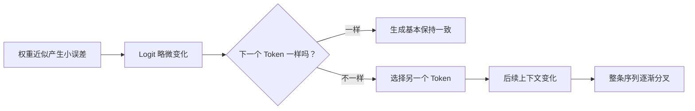

# LLM 量化之后，真正变化的是什么？

*量化可以把显存占用大幅压下来，而 benchmark 分数看起来几乎没动。真正值得关心的是：在平均分还没明显变化之前，模型的行为是不是已经悄悄变了。*

我以前一直把量化看成一种很直接的部署优化。

先用 FP16 跑一遍，记录显存、延迟和 benchmark；再换成 8-bit 或 4-bit，重新测一次。如果显存明显下降，分数只掉一点，那基本就算成功。

这个判断方式并不算错。

但它很容易把一个更重要的问题藏起来：

**平均分差不多，不代表模型的行为也差不多。**

一个量化后的模型，可能在总体准确率上和高精度版本几乎没有区别，但在一些更具体、也更接近真实系统的地方已经发生变化：

- 多步指令更容易漏掉某一步；
- JSON、函数调用或结构化输出更容易出错；
- 两个动作接近时，更容易选到另一个；
- 长文本生成更容易偏离原来的轨迹；
- Agent 场景里，Tool Calling 的路径出现变化。

这些问题通常不会表现成“模型突然不能用了”。

更多时候，它们只是一些很小的数值扰动。

绝大多数扰动都不会改变最终输出。

但只要某次决策原本就很接近边界，一个很小的变化，就可能让模型选到另一个 token。后面的上下文随之改变，整条生成轨迹也可能慢慢分叉。

所以，我现在更愿意问的不是：

> 4-bit 量化会损失多少准确率？

而是：

> **当数值精度下降之后，哪些行为最先变得不稳定？这些变化对实际系统到底重要不重要？**

这样一来，量化就不只是压缩模型。

它同时也是一次模型行为的重新评估。

## 显存收益当然是真的

先说最直观的部分。

如果暂时只考虑模型权重，一个有 \(N\) 个参数的模型，大致需要：

\[
\text{Memory} \approx N \times \text{bits per parameter}
\]

以 7B 模型为例。

FP16 下大约需要：

\[
7 \times 10^9 \times 16 \text{ bits}
\approx 14 \text{ GB}
\]

8-bit 大约 7 GB。

4-bit 大约 3.5 GB。

真实部署当然还会有别的开销，包括量化元数据、运行时 Buffer、激活值、KV Cache 和各种中间状态。

所以这些数字不能直接当成最终显存占用。

但数量级上的变化非常清楚。

| 权重格式 | 7B 模型权重占用（约） | 相对 FP16 |
|---|---:|---:|
| FP32 | 28 GB | 2× |
| FP16 / BF16 | 14 GB | 1× |
| INT8 | 7 GB | 0.5× |
| INT4 | 3.5 GB | 0.25× |

这个差距往往会直接改变一个模型能不能被实际部署。

原本只能勉强塞进大显存 GPU 的模型，量化后可能一下子多出不少空间。

原本只能在服务器上跑的小模型，可能开始适合本地部署。

有些原本必须依赖远程 API 的应用，也会因为量化变得适合 On-device Inference。

这也是量化最吸引人的地方：

**收益直接、可测，而且通常很大。**

但显存也是最容易测清楚的部分。

真正麻烦的是，其他变化没这么直观。

## 量化不是“把数字缩小一点”这么简单

最直观的理解是：

量化把原来比较细的连续数值，映射到更少的一组离散值上。

比如原始权重可能是：

```text
0.137
0.141
0.148
0.905
-0.332
```

低精度表示之后，可能变成：

```text
0.14
0.14
0.14
0.91
-0.35
```

每个误差单独看都不大。

但模型里不是几个参数，而是几十亿甚至上百亿个参数。

从数值上说，量化后的模型已经不是原来的模型了。

一个极简的量化过程可以写成：

\[
q = \text{round}\left(\frac{x}{s}\right)
\]

然后再近似恢复：

\[
\hat{x} = s q
\]

这里的 \(s\) 是缩放因子，\(q\) 是量化后的值。

真实的量化方法当然更复杂。

会有 Per-Channel Scaling、Group-wise Quantization、Mixed Precision，也会对 Outlier 做特殊处理，还可能依赖 Calibration Data。

这些方法之所以有必要，本质上是因为：

**不同权重对误差的敏感程度不一样。**

有些权重偏一点，模型行为几乎不受影响。

有些权重只要变化很小，就可能影响后面的判断。

而且这种敏感性，并不能只靠看权重大小判断出来。

## 更低的 bit 数，不一定换来更低的延迟

从 FP16 压到 INT4 之后，很多人都会自然地产生一个期待：

既然模型小了这么多，推理应该也快很多吧？

不一定。

真实推理更接近这样：

```text
       Quantized Weights
               │
               ▼
      ┌──────────────────┐
      │ Load from Memory │
      └────────┬─────────┘
               │
               ▼
      ┌──────────────────┐
      │ Dequant / Kernel │
      │ Computation      │
      └────────┬─────────┘
               │
               ▼
      ┌──────────────────┐
      │ Activations      │
      └────────┬─────────┘
               │
               ▼
           Next Token
```

量化确实能减少内存带宽压力。

这很重要，因为 LLM 的 autoregressive decoding 很多时候受限于 Memory Bandwidth。

但推理速度还取决于很多别的东西：

- 硬件是否原生支持这种低精度格式；
- 推理框架有没有高效 Kernel；
- 权重是否需要额外解包或反量化；
- Batch Size 多大；
- Context Length 多长；
- KV Cache 占了多少。

比如，有些 GPU 对 INT8 支持得很好，但对某些 4-bit 格式的优化并不理想。

这种情况下，模型虽然更小，但速度未必提升多少。

极端一点，甚至可能更慢。

还有一个很容易被忽略的部分：KV Cache。

权重变成 4-bit，并不等于 KV Cache 也自动缩小到四分之一。

在长上下文场景里，KV Cache 本身就可能吃掉大量显存。

所以如果我要比较 FP16 和 INT4，我至少会分开看：

- 模型加载后的显存；
- 推理时的 Peak Memory；
- Time to First Token；
- Decode Tokens per Second。

如果只写一句“4-bit 更快”，其实信息量很有限。

**4-bit 只是权重表示方式，不是一整套推理系统。**

## 总分相近，可能掩盖很多局部变化

假设我跑了一个 benchmark。

FP16：78.4%。

INT4：78.1%。

只差 0.3 个百分点。

看起来几乎没有退化。

这可能确实没什么问题。

但如果再往下一层看，情况可能完全不同。

假设测试集有 1,000 个样本。

即使两个模型最后都答对了大约 780 个，也不代表它们答对的是同一批样本。

例如：

| 任务类型 | FP16 | INT4 |
|---|---:|---:|
| 常见知识问答 | 95% | 95% |
| 简单分类 | 91% | 91% |
| 多步指令 | 82% | 78% |
| JSON 生成 | 94% | 88% |
| 稀有领域术语 | 71% | 65% |
| 总体 | 86.6% | 83.4% |

但就算这样看，还是不够。

我更想看 paired comparison：

```text
FP16 对，INT4 对：      720
FP16 错，INT4 错：      140
FP16 对，INT4 错：       80
FP16 错，INT4 对：       60
```

最终总分只差 20 个样本。

但实际上，两个模型在 **140 个样本上给出了不同结果**。

这就完全不是“几乎没变化”这么简单了。

平均分可以差不多，但模型在很多具体决策上已经发生了变化。

对于只关心平均准确率的任务，这也许没关系。

但如果模型要在 `read_database` 和 `delete_record` 之间做选择，这种局部变化就不能忽略。

## 很小的 Logit 变化，也可能把后面的轨迹全部带走

自回归生成最有意思的地方，就在这里。

假设高精度模型在某一步给出的概率是：

```text
"approve"     0.41
"reject"      0.39
"request"     0.12
...
```

量化之后变成：

```text
"approve"     0.39
"reject"      0.41
"request"     0.12
...
```

数值变化很小。

但最终选中的 token 已经不一样了。

接下来，下一个 token 会基于新的上下文生成。

再下一个 token，又基于已经变化的上下文继续生成。

于是，小扰动开始被不断传递：



大多数时候，这种差异不会真正影响结果。

如果某个 token 的优势足够明显，量化后的轻微扰动也不会改变最终选择。

真正敏感的是那些“本来就差一点”的情况。

当两个 token、两个动作、两个解释几乎打平时，量化误差就可能成为最后那个决定因素。

所以，量化敏感性不仅取决于模型。

它也取决于任务本身。

## 有些能力，比另一些更容易先出问题

如果我要评估一个量化模型，我不会只跑一个通用 benchmark 就结束。

我会专门挑那些“小变化可能造成大后果”的任务。

结构化输出就是最明显的一类。

比如一个 Agent 需要返回：

```json
{
  "tool": "search_products",
  "arguments": {
    "query": "wireless keyboard"
  }
}
```

普通自然语言输出有很大的容错空间。

换个说法，大多数时候不影响意思。

但 Tool API 没这么宽容。

多输出一句解释、漏掉一个引号、字段名拼错、Enum 值选错、少一个 Required Field，都可能直接从“基本正确”变成 Runtime Error。

指令约束也是类似的问题。

比如：

> 总结这份文档，但不要输出任何个人身份信息。

量化后的模型可能仍然很会总结。

真正变差的，是它对第二条约束的遵守程度。

长上下文任务里也可能出现另一种变化。

模型没有突然失去阅读能力，但 Attention 分布发生轻微变化以后，一条本来就比较弱的证据，可能更容易输给一个 Distractor。

稀有 token、专业术语、低频表达也值得关注。

因为这些位置上的概率边界，往往没有常见 token 那么稳定。

这些都不是固定规律。

不同模型、不同量化方法，表现可能完全不同。

但也正因为这样，“质量损失”这个说法其实太粗了。

## 对 Agent 来说，小误差的代价会被放大

普通文本生成里，一个 token 变了，结果可能只是某句话换了一种说法。

Agent 场景不一样。

一个 token 可能对应一个真实动作。

比如：

```text
用户请求
    ↓
LLM 选择 Tool
    ↓
Tool 修改外部状态
    ↓
LLM 读取 Tool Result
    ↓
LLM 再选择下一个 Tool
```

这个时候，模型已经不是单纯在生成文本。

它正在参与一个会改变外部状态的反馈系统。

如果量化让第一步 Tool Call 发生变化，后面所有 Observation 都可能跟着变。

例如：

```text
FP16
search_inventory
→ inspect_item
→ ask_user_confirmation
→ purchase_item

INT4
search_inventory
→ inspect_item
→ purchase_item
```

从传统 NLP benchmark 的角度看，这两个模型都理解了任务。

但从 Agent Evaluation 的角度看，其中一个模型漏掉了必须执行的确认步骤。

所以我对这类说法一直比较谨慎：

> 量化后保留了 99% 的原始性能。

99% 的什么？

Perplexity？

Multiple Choice Accuracy？

Human Preference？

Tool Call Success？

Constraint Satisfaction？

End-to-End Task Completion？

Safety Compliance？

这些并不是同一个指标。

量化可能几乎完全保住其中一个，同时让另一个明显变差。

## “4-bit” 其实不是一个完整配置

还有一个很容易被忽略的问题：

所谓“4-bit 模型”，并不是唯一的一种东西。

你可以只量化权重，也可以连 Activation 一起量化。

可以用不同的 Group Size。

可以让某些敏感 Layer 保持更高精度。

可以做 Post-Training Quantization，也可以做 Quantization-Aware Training。

Calibration Data 也会影响最终结果。

大致可以这样理解：

| 方法 | 优点 | 代价 |
|---|---|---|
| FP16 / BF16 | 质量稳定，部署简单 | 显存高 |
| INT8 | 压缩明显，通常比较稳妥 | 显存收益不如 4-bit |
| 4-bit Weight-only | 显存下降非常明显 | 对量化方法更敏感 |
| Mixed Precision | 可以保护敏感部分 | 配置更复杂 |
| Quantization-Aware Training | 模型能适应低精度 | 需要额外训练和算力 |

Outlier 是这里面一个很典型的问题。

假设某个 Group 里绝大多数权重都在 -0.2 到 0.2 之间，但有一个值突然到了 4.8。

如果整组共用同一个 Scale，那么这个 4.8 会占掉很大一部分可表示范围。

结果就是，大量原本分布很密集的小权重，只能用更粗的间隔表示。

Group-wise Quantization 和一些 Outlier-aware 方法，本质上就是在处理类似问题。

所以两个人都说：

> 我测了 4-bit 模型。

实际上，他们测的可能根本不是同一种量化配置。

## Benchmark 说没问题，生产环境未必同意

如果是实际部署，我最不放心的流程大概是：

```text
1. 跑 FP16 benchmark
2. 跑 INT4 benchmark
3. 比较平均分
4. 上线
```

这个流程没有错。

只是它回答的问题太少。

我更愿意额外做一套和真实应用高度相关的小型测试集。

如果是 Agent，我至少会检查：

```text
✓ Tool 是否选对
✓ Required Arguments 是否完整
✓ Forbidden Tools 是否被避免
✓ 需要确认时是否真的确认
✓ JSON Schema 是否合法
✓ 多步指令是否完整执行
✓ Long-context Evidence 是否正确使用
✓ 多次运行是否稳定
```

然后让 FP16 和量化模型跑完全相同的 Prompt IDs。

我想看的不只是“差了多少”。

我更想知道“具体差在哪里”。

如果可以，我还会看一下决策 Margin。

一个模型可能还答对了某道题，但从原来很明确的 0.8 vs 0.1，变成了 0.51 vs 0.49。

输出暂时没错。

但鲁棒性可能已经下降了。

另外，我也不会只测 Greedy Decoding。

Sampling、长输出、多轮 Agent Loop，都更容易暴露这类局部不稳定。

## 真正部署 4-bit 之前，我会测什么

我会把指标分成两组。

第一组是系统层面：

```text
Memory
├── Weight Memory
├── Peak GPU Memory
└── KV Cache Growth

Latency
├── Model Loading
├── Time to First Token
└── Tokens per Second

Runtime
├── Target Hardware
├── Kernel Support
└── Batch Size Behavior
```

第二组是行为层面：

```text
Behavior
├── Task Success
├── Instruction Following
├── Structured Output
├── Tool Selection
├── Constraint Adherence
├── Long-context Behavior
└── Run-to-run Stability
```

只有两边一起看，结果才有意义。

假设最后得到这样一组数据：

| 指标 | BF16 | INT8 | INT4 |
|---|---:|---:|---:|
| GPU 显存 | 15.2 GB | 8.6 GB | 5.1 GB |
| Decode Speed | 42 tok/s | 51 tok/s | 57 tok/s |
| General Eval | 78.4 | 78.3 | 77.9 |
| Tool Success | 91.0% | 90.8% | 87.4% |
| Valid JSON | 98.7% | 98.5% | 94.1% |

这些数字是虚构的。

但我真正想看的，就是这种结果。

因为只有这样，Trade-off 才真正清楚。

如果做的是一个跑在笔记本上的离线总结工具，INT4 可能非常划算。

但如果模型是一个会调用真实工具、修改外部状态的 Agent，那么为了省几 GB 显存，牺牲几个百分点的 Tool Reliability，可能就完全不值得。

不存在一种永远正确的精度。

只有一种最适合当前系统约束的精度。

## 我现在更愿意把量化当成一次模型变更

这是我觉得最有用的一个判断。

量化看起来很像纯粹的基础设施优化。

像是换一个 Kernel、换一个 Runtime、换一个容器镜像。

但实际上：

**权重变了。**

所以，模型也变了。

变化通常不大。

但已经足够让我不再把量化模型看成“同一个模型，只是更省显存”。

我更愿意把它当成一个新的 Checkpoint。

这意味着，和业务真正相关的评估应该重新跑一遍。

不是把网上所有 benchmark 全部重跑。

而是重新验证那些系统真正依赖的能力。

如果系统依赖 Function Calling，那就专门测 Function Calling。

如果系统依赖长上下文，就专门测 Long-context Retrieval。

如果 Safety Constraint 很重要，就专门测这些约束。

如果量化的目标是降低延迟，那就直接在目标硬件上测。

不要因为 bit 数变少，就默认它一定更快。

量化最容易让人掉进的坑，其实很简单：

显存确实变小了，于是我们下意识觉得其他东西也应该差不多，甚至一起变好。

现实通常没这么整齐。

## 4-bit 不会让模型“笨四倍”

把 FP16 模型压到 4-bit，当然不等于模型直接丢掉了四分之三的能力。

神经网络对数值近似的容忍度其实很高。

如果不是这样，激进量化根本不会这么好用。

但这种“看起来基本没事”的稳定性，有时候反而更容易让人放松警惕。

真正有意思的退化，很少长这样：

> 模型突然不会说话了。

更多时候，它会是：

> 主任务还能做，但某个附加约束更容易被忽略。

或者：

> Benchmark 几乎没变，但两个版本在不少具体样本上做出了不同选择。

或者：

> 显存下降了 60%，但目标 GPU 对这个量化格式支持一般，所以延迟没怎么改善。

又或者，在 Agent 场景里：

> 一切看起来都很正常，直到某一步两个 token 本来就差不多，一个很小的数值变化让模型选了另一个 Tool，后面的整条轨迹也跟着变了。

所以，如果要回答“LLM 量化之后到底损失了什么”，我觉得最值得关注的并不是“智能”本身。

**更可能先发生变化的，是决策余量、行为稳定性，以及我们对“它还是不是同一个模型”的那种确定感。**

---

## 首页摘要

量化可以大幅降低 LLM 的显存占用，而 benchmark 分数几乎不变。但 Tool Calling、结构化输出、延迟和行为稳定性，往往不会以同样的方式变化。

## Tags

`LLM` · `量化` · `模型优化` · `LLM Evaluation` · `AI Agent` · `Inference` · `Machine Learning Systems`
